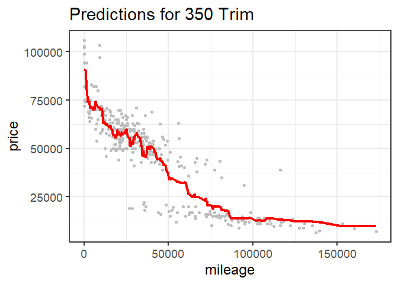

Question 1
----------

With our Austin flight data, I wanted to look at cancellations not just
by the day of the week, but also by the listed cause of delay.

There are some clear trends that can be seen in these bar graphs.
Carrier cancellations are most common during the week and less common on
weekend flights. NAS cancellations are more common on Monday and
Tuesday, with the rest of the days being fairly similar. Lastly, weather
delays are more common on weekends, but Tuesday seems to be an outlier.

Question 2
----------

The following is from the code Dr. Scott provided that extracts the 350
and 65 AMG trim levels as subsets of the data.

    ##        id             trim       subTrim    condition  isOneOwner
    ##  Min.   :  282   350    :416   Hybrid:  0   CPO :131   f:310     
    ##  1st Qu.:14290   320    :  0   unsp  :416   New : 15   t:106     
    ##  Median :26658   400    :  0                Used:270             
    ##  Mean   :26520   420    :  0                                     
    ##  3rd Qu.:39599   430    :  0                                     
    ##  Max.   :52220   450    :  0                                     
    ##                  (Other):  0                                     
    ##     mileage            year          color      displacement
    ##  Min.   :     6   Min.   :1994   Black  :219   3.0 L  :302  
    ##  1st Qu.: 19264   1st Qu.:2006   Silver : 77   3.7 L  :109  
    ##  Median : 29998   Median :2012   White  : 48   3.5 L  :  5  
    ##  Mean   : 42926   Mean   :2010   Gray   : 30   3.2 L  :  0  
    ##  3rd Qu.: 63479   3rd Qu.:2012   unsp   : 21   4.2 L  :  0  
    ##  Max.   :173000   Max.   :2013   Blue   : 11   4.3 L  :  0  
    ##                                  (Other): 10   (Other):  0  
    ##        fuel         state         region             soundSystem 
    ##  Diesel  :307   CA     : 57   SoA    :138   Alpine         :  0  
    ##  Gasoline:109   FL     : 47   Pac    : 68   Bang Olufsen   :  5  
    ##  Hybrid  :  0   TX     : 41   Mid    : 52   Bose           : 18  
    ##  unsp    :  0   IL     : 37   ENC    : 51   Boston Acoustic:  0  
    ##                 VA     : 32   WSC    : 45   Harman Kardon  :106  
    ##                 NJ     : 27   New    : 24   Premium        :130  
    ##                 (Other):175   (Other): 38   unsp           :157  
    ##    wheelType     wheelSize    featureCount        price       
    ##  Alloy  :225   unsp   :384   Min.   :  0.00   Min.   :  6600  
    ##  Chrome :  1   18     : 12   1st Qu.: 31.75   1st Qu.: 19401  
    ##  Premium:  6   17     : 10   Median : 54.00   Median : 52900  
    ##  Steel  :  0   19     :  6   Mean   : 49.22   Mean   : 46854  
    ##  unsp   :184   20     :  4   3rd Qu.: 70.00   3rd Qu.: 61991  
    ##                16     :  0   Max.   :112.00   Max.   :106010  
    ##                (Other):  0

    ##        id             trim       subTrim    condition  isOneOwner
    ##  Min.   : 1060   65 AMG :292   Hybrid:  0   CPO : 26   f:254     
    ##  1st Qu.:13977   320    :  0   unsp  :292   New : 91   t: 38     
    ##  Median :26557   350    :  0                Used:175             
    ##  Mean   :26444   400    :  0                                     
    ##  3rd Qu.:38687   420    :  0                                     
    ##  Max.   :52326   430    :  0                                     
    ##                  (Other):  0                                     
    ##     mileage            year          color      displacement
    ##  Min.   :     1   Min.   :2006   Black  :182   6.0 L  :285  
    ##  1st Qu.:    20   1st Qu.:2007   Silver : 39   unsp   :  7  
    ##  Median : 28803   Median :2010   White  : 27   3.0 L  :  0  
    ##  Mean   : 33700   Mean   :2010   Gray   : 22   3.2 L  :  0  
    ##  3rd Qu.: 58496   3rd Qu.:2015   unsp   : 10   3.5 L  :  0  
    ##  Max.   :146975   Max.   :2015   Blue   :  7   3.7 L  :  0  
    ##                                  (Other):  5   (Other):  0  
    ##        fuel         state         region            soundSystem 
    ##  Diesel  :  0   CA     : 75   Pac    :79   Alpine         :  0  
    ##  Gasoline:279   FL     : 44   SoA    :63   Bang Olufsen   : 31  
    ##  Hybrid  :  0   TX     : 27   Mid    :34   Bose           : 13  
    ##  unsp    : 13   IL     : 18   ENC    :33   Boston Acoustic:  0  
    ##                 NY     : 15   WSC    :32   Harman Kardon  : 42  
    ##                 NJ     : 12   Mtn    :17   Premium        : 92  
    ##                 (Other):101   (Other):34   unsp           :114  
    ##    wheelType     wheelSize    featureCount        price       
    ##  Alloy  :136   unsp   :252   Min.   :  0.00   Min.   : 18990  
    ##  Chrome :  2   20     : 39   1st Qu.: 17.00   1st Qu.: 48711  
    ##  Premium:  9   18     :  1   Median : 58.00   Median : 79995  
    ##  Steel  :  0   16     :  0   Mean   : 48.09   Mean   :117121  
    ##  unsp   :145   17     :  0   3rd Qu.: 72.00   3rd Qu.:225975  
    ##                19     :  0   Max.   :112.00   Max.   :247075  
    ##                (Other):  0

The following are the Root Mean-Squared Errors (RMSE) for each of the
trim types at specified:

### Trim: 350

-   (K = 5) = 9703.9236517
-   (K = 10) = 9448.1563189
-   (K = 25) = 9349.3369299
-   (K = 50) = 9183.6571291
-   (K = 100) = 9694.94673
-   (K = 150) = 1.174011410^{4}
-   (K = 200) = 1.412234810^{4}

### Trim: 65 AMG

-   (K = 5) = 2.784152210^{4}
-   (K = 10) = 2.639454210^{4}
-   (K = 25) = 2.670936910^{4}
-   (K = 50) = 2.696305910^{4}
-   (K = 100) = 4.147416710^{4}
-   (K = 150) = 6.145970710^{4}
-   (K = 200) = 7.855902910^{4}

We can look at plots of RMSE versus K to estimate what the optimal K is
for each trim.

    ## -------------------------------------------------------------------------

    ## You have loaded plyr after dplyr - this is likely to cause problems.
    ## If you need functions from both plyr and dplyr, please load plyr first, then dplyr:
    ## library(plyr); library(dplyr)

    ## -------------------------------------------------------------------------

    ## 
    ## Attaching package: 'plyr'

    ## The following object is masked from 'package:mosaic':
    ## 
    ##     count

    ## The following objects are masked from 'package:dplyr':
    ## 
    ##     arrange, count, desc, failwith, id, mutate, rename, summarise,
    ##     summarize

    ## The following object is masked from 'package:purrr':
    ## 
    ##     compact

    ##          RMSE   K
    ## 1       0.000   0
    ## 2       0.000   0
    ## 3       0.000   0
    ## 4       0.000   0
    ## 5    9703.924   5
    ## 6    9689.805   6
    ## 7    9713.112   7
    ## 8    9636.169   8
    ## 9    9595.240   9
    ## 10   9448.156  10
    ## 11   9414.609  11
    ## 12   9319.452  12
    ## 13   9232.105  13
    ## 14   9131.086  14
    ## 15   9224.846  15
    ## 16   9258.609  16
    ## 17   9214.968  17
    ## 18   9337.363  18
    ## 19   9361.701  19
    ## 20   9369.814  20
    ## 21   9367.965  21
    ## 22   9363.750  22
    ## 23   9405.930  23
    ## 24   9370.633  24
    ## 25   9349.337  25
    ## 26   9339.452  26
    ## 27   9358.431  27
    ## 28   9340.536  28
    ## 29   9311.411  29
    ## 30   9356.475  30
    ## 31   9361.056  31
    ## 32   9351.677  32
    ## 33   9253.036  33
    ## 34   9271.817  34
    ## 35   9166.990  35
    ## 36   9154.513  36
    ## 37   9131.613  37
    ## 38   9110.918  38
    ## 39   9100.622  39
    ## 40   9136.978  40
    ## 41   9123.726  41
    ## 42   9125.028  42
    ## 43   9121.758  43
    ## 44   9155.560  44
    ## 45   9167.765  45
    ## 46   9164.312  46
    ## 47   9191.143  47
    ## 48   9178.212  48
    ## 49   9179.004  49
    ## 50   9183.657  50
    ## 51   9188.137  51
    ## 52   9199.636  52
    ## 53   9169.945  53
    ## 54   9188.498  54
    ## 55   9168.785  55
    ## 56   9138.472  56
    ## 57   9145.064  57
    ## 58   9144.587  58
    ## 59   9148.076  59
    ## 60   9162.010  60
    ## 61   9124.565  61
    ## 62   9146.460  62
    ## 63   9118.288  63
    ## 64   9100.448  64
    ## 65   9094.773  65
    ## 66   9098.268  66
    ## 67   9069.134  67
    ## 68   9090.760  68
    ## 69   9082.730  69
    ## 70   9089.357  70
    ## 71   9095.912  71
    ## 72   9109.014  72
    ## 73   9111.498  73
    ## 74   9139.218  74
    ## 75   9152.094  75
    ## 76   9174.914  76
    ## 77   9197.441  77
    ## 78   9235.121  78
    ## 79   9236.596  79
    ## 80   9257.956  80
    ## 81   9277.903  81
    ## 82   9284.066  82
    ## 83   9307.943  83
    ## 84   9314.927  84
    ## 85   9309.504  85
    ## 86   9340.205  86
    ## 87   9333.279  87
    ## 88   9377.925  88
    ## 89   9375.475  89
    ## 90   9405.956  90
    ## 91   9423.657  91
    ## 92   9472.614  92
    ## 93   9484.233  93
    ## 94   9534.167  94
    ## 95   9573.200  95
    ## 96   9593.657  96
    ## 97   9625.257  97
    ## 98   9656.293  98
    ## 99   9677.265  99
    ## 100  9694.947 100
    ## 101  9736.554 101
    ## 102  9756.358 102
    ## 103  9776.056 103
    ## 104  9823.794 104
    ## 105  9859.972 105
    ## 106  9906.388 106
    ## 107  9941.118 107
    ## 108  9973.111 108
    ## 109 10021.330 109
    ## 110 10057.479 110
    ## 111 10093.948 111
    ## 112 10136.662 112
    ## 113 10158.516 113
    ## 114 10187.974 114
    ## 115 10228.134 115
    ## 116 10243.992 116
    ## 117 10302.231 117
    ## 118 10325.560 118
    ## 119 10374.160 119
    ## 120 10427.743 120
    ## 121 10471.529 121
    ## 122 10502.952 122
    ## 123 10531.658 123
    ## 124 10564.461 124
    ## 125 10615.031 125
    ## 126 10662.047 126
    ## 127 10714.135 127
    ## 128 10769.294 128
    ## 129 10816.111 129
    ## 130 10852.126 130
    ## 131 10896.535 131
    ## 132 10935.814 132
    ## 133 10975.547 133
    ## 134 11010.141 134
    ## 135 11069.526 135
    ## 136 11132.674 136
    ## 137 11167.385 137
    ## 138 11221.775 138
    ## 139 11248.322 139
    ## 140 11303.417 140
    ## 141 11324.222 141
    ## 142 11389.232 142
    ## 143 11458.961 143
    ## 144 11508.013 144
    ## 145 11552.745 145
    ## 146 11576.023 146
    ## 147 11659.362 147
    ## 148 11685.803 148
    ## 149 11698.532 149
    ## 150 11740.114 150
    ## 151 11796.068 151
    ## 152 11854.375 152
    ## 153 11914.791 153
    ## 154 11968.662 154
    ## 155 12013.647 155
    ## 156 12060.912 156
    ## 157 12132.039 157
    ## 158 12167.588 158
    ## 159 12213.236 159
    ## 160 12257.926 160
    ## 161 12309.312 161
    ## 162 12363.554 162
    ## 163 12400.488 163
    ## 164 12454.963 164
    ## 165 12527.773 165
    ## 166 12590.141 166
    ## 167 12618.027 167
    ## 168 12661.598 168
    ## 169 12712.598 169
    ## 170 12763.193 170
    ## 171 12809.900 171
    ## 172 12860.246 172
    ## 173 12901.818 173
    ## 174 12956.748 174
    ## 175 13003.564 175
    ## 176 13034.679 176
    ## 177 13073.685 177
    ## 178 13138.908 178
    ## 179 13179.574 179
    ## 180 13208.988 180
    ## 181 13250.434 181
    ## 182 13289.508 182
    ## 183 13325.046 183
    ## 184 13389.907 184
    ## 185 13441.371 185
    ## 186 13458.526 186
    ## 187 13545.056 187
    ## 188 13573.122 188
    ## 189 13606.227 189
    ## 190 13643.988 190
    ## 191 13692.092 191
    ## 192 13754.623 192
    ## 193 13799.924 193
    ## 194 13844.855 194
    ## 195 13898.278 195
    ## 196 13935.308 196
    ## 197 13955.880 197
    ## 198 14002.398 198
    ## 199 14069.379 199
    ## 200 14122.348 200

    ## Warning: Removed 4 rows containing missing values (geom_path).

For the 350 trim, our optimum value of K is K = 15

    library(plyr)

    ##         RMSE   K
    ## 1       0.00   0
    ## 2       0.00   0
    ## 3       0.00   0
    ## 4       0.00   0
    ## 5   27841.52   5
    ## 6   27076.92   6
    ## 7   26679.83   7
    ## 8   26039.46   8
    ## 9   26181.31   9
    ## 10  26394.54  10
    ## 11  26018.83  11
    ## 12  26282.81  12
    ## 13  26246.23  13
    ## 14  25783.20  14
    ## 15  25854.26  15
    ## 16  25898.83  16
    ## 17  26232.02  17
    ## 18  26330.96  18
    ## 19  26449.54  19
    ## 20  26578.70  20
    ## 21  26604.35  21
    ## 22  26560.19  22
    ## 23  26716.30  23
    ## 24  26697.15  24
    ## 25  26709.37  25
    ## 26  26642.72  26
    ## 27  26665.19  27
    ## 28  26493.99  28
    ## 29  26512.51  29
    ## 30  26502.24  30
    ## 31  26546.80  31
    ## 32  26605.04  32
    ## 33  26690.24  33
    ## 34  26714.81  34
    ## 35  26794.10  35
    ## 36  26915.17  36
    ## 37  26926.55  37
    ## 38  26986.28  38
    ## 39  26888.00  39
    ## 40  26919.85  40
    ## 41  26842.99  41
    ## 42  26809.64  42
    ## 43  26750.94  43
    ## 44  26747.61  44
    ## 45  26765.58  45
    ## 46  26744.35  46
    ## 47  26662.30  47
    ## 48  26759.33  48
    ## 49  26838.78  49
    ## 50  26963.06  50
    ## 51  27089.77  51
    ## 52  26984.24  52
    ## 53  26938.24  53
    ## 54  27010.27  54
    ## 55  27093.86  55
    ## 56  27345.46  56
    ## 57  27523.71  57
    ## 58  27534.11  58
    ## 59  27634.10  59
    ## 60  27840.78  60
    ## 61  28018.76  61
    ## 62  28126.49  62
    ## 63  28347.54  63
    ## 64  28555.13  64
    ## 65  28824.45  65
    ## 66  29087.74  66
    ## 67  29338.25  67
    ## 68  29617.46  68
    ## 69  29871.61  69
    ## 70  30080.81  70
    ## 71  30355.86  71
    ## 72  30588.05  72
    ## 73  30810.28  73
    ## 74  31014.13  74
    ## 75  31226.86  75
    ## 76  31456.51  76
    ## 77  31696.22  77
    ## 78  32085.77  78
    ## 79  32488.51  79
    ## 80  32833.54  80
    ## 81  33212.44  81
    ## 82  33554.93  82
    ## 83  33974.35  83
    ## 84  34276.22  84
    ## 85  34682.25  85
    ## 86  35093.94  86
    ## 87  35586.97  87
    ## 88  36013.91  88
    ## 89  36477.76  89
    ## 90  36764.42  90
    ## 91  37224.08  91
    ## 92  37750.67  92
    ## 93  38180.66  93
    ## 94  38577.25  94
    ## 95  39022.50  95
    ## 96  39478.43  96
    ## 97  40090.51  97
    ## 98  40528.93  98
    ## 99  41074.30  99
    ## 100 41474.17 100
    ## 101 41918.34 101
    ## 102 42501.11 102
    ## 103 42868.33 103
    ## 104 43464.74 104
    ## 105 44019.52 105
    ## 106 44439.30 106
    ## 107 44895.61 107
    ## 108 45300.73 108
    ## 109 45422.51 109
    ## 110 45829.50 110
    ## 111 46407.50 111
    ## 112 46991.68 112
    ## 113 47539.19 113
    ## 114 48011.30 114
    ## 115 48488.79 115
    ## 116 49025.49 116
    ## 117 49577.72 117
    ## 118 50034.06 118
    ## 119 50578.17 119
    ## 120 51016.20 120
    ## 121 51501.85 121
    ## 122 51925.80 122
    ## 123 52326.50 123
    ## 124 52650.60 124
    ## 125 53042.82 125
    ## 126 53458.51 126
    ## 127 53736.88 127
    ## 128 54074.43 128
    ## 129 54345.31 129
    ## 130 54686.43 130
    ## 131 55093.11 131
    ## 132 55435.06 132
    ## 133 55684.85 133
    ## 134 56002.24 134
    ## 135 56401.26 135
    ## 136 56768.35 136
    ## 137 57047.77 137
    ## 138 57412.58 138
    ## 139 57749.60 139
    ## 140 58110.75 140
    ## 141 58431.69 141
    ## 142 58827.44 142
    ## 143 59104.84 143
    ## 144 59339.49 144
    ## 145 59754.69 145
    ## 146 60139.26 146
    ## 147 60446.76 147
    ## 148 60778.40 148
    ## 149 61154.55 149
    ## 150 61459.71 150
    ## 151 61835.77 151
    ## 152 62125.99 152
    ## 153 62370.57 153
    ## 154 62699.25 154
    ## 155 63015.16 155
    ## 156 63355.68 156
    ## 157 63676.12 157
    ## 158 64026.11 158
    ## 159 64363.18 159
    ## 160 64683.79 160
    ## 161 65004.11 161
    ## 162 65360.25 162
    ## 163 65634.04 163
    ## 164 66024.54 164
    ## 165 66379.21 165
    ## 166 66744.17 166
    ## 167 67053.07 167
    ## 168 67427.10 168
    ## 169 67727.15 169
    ## 170 68037.90 170
    ## 171 68338.19 171
    ## 172 68685.03 172
    ## 173 69079.63 173
    ## 174 69463.93 174
    ## 175 69835.21 175
    ## 176 70246.85 176
    ## 177 70606.47 177
    ## 178 70986.24 178
    ## 179 71360.34 179
    ## 180 71725.03 180
    ## 181 72093.25 181
    ## 182 72498.49 182
    ## 183 72830.47 183
    ## 184 73227.52 184
    ## 185 73518.60 185
    ## 186 73882.66 186
    ## 187 74234.56 187
    ## 188 74510.51 188
    ## 189 74862.45 189
    ## 190 75199.19 190
    ## 191 75523.44 191
    ## 192 75863.57 192
    ## 193 76197.05 193
    ## 194 76563.16 194
    ## 195 76892.26 195
    ## 196 77220.22 196
    ## 197 77543.15 197
    ## 198 77841.77 198
    ## 199 78200.67 199
    ## 200 78559.03 200

    ## Warning: Removed 4 rows containing missing values (geom_path).

 It is harder
to tell for the 65 AMG trim, but it seems that our optimal K is
approximately 25.

    ##        id   trim subTrim condition isOneOwner mileage year  color
    ## 1   45262 65 AMG    unsp       New          f       1 2015  Black
    ## 2   33366 65 AMG    unsp       New          f       1 2015  Green
    ## 3    6350 65 AMG    unsp       New          f       3 2015   unsp
    ## 4   19472 65 AMG    unsp       New          f       3 2015   unsp
    ## 5   35314 65 AMG    unsp       New          f       5 2015   unsp
    ## 6   28775 65 AMG    unsp       New          f       5 2015  Black
    ## 7    2771 65 AMG    unsp       New          f       5 2013  White
    ## 8   45927 65 AMG    unsp       New          f       5 2015   unsp
    ## 9   24133 65 AMG    unsp       New          f       6 2015 Silver
    ## 10  37364 65 AMG    unsp       New          f       6 2015  Black
    ## 11  10196 65 AMG    unsp       New          f       6 2015  Black
    ## 12  46555 65 AMG    unsp       New          f       6 2015  Black
    ## 13  16111 65 AMG    unsp       New          f       7 2015  Black
    ## 14   3576 65 AMG    unsp       New          f       7 2015  Black
    ## 15  37366 65 AMG    unsp       New          f       7 2015  Black
    ## 16  11518 65 AMG    unsp       New          f       7 2015  Black
    ## 17  31371 65 AMG    unsp       New          f       7 2015  White
    ## 18  32025 65 AMG    unsp       New          f       7 2015  Black
    ## 19   2310 65 AMG    unsp       New          f       7 2015  White
    ## 20   7620 65 AMG    unsp       New          f       8 2015  Black
    ## 21  20798 65 AMG    unsp       New          f       8 2015  Black
    ## 22  43248 65 AMG    unsp       New          f       8 2015 Silver
    ## 23  31370 65 AMG    unsp       New          f       8 2015  Black
    ## 24  52326 65 AMG    unsp       New          f      10 2015  Black
    ## 25   7619 65 AMG    unsp       New          f      10 2015  Black
    ## 26  45923 65 AMG    unsp       New          f      10 2015 Silver
    ## 27   5015 65 AMG    unsp       New          f      10 2015  Black
    ## 28  34040 65 AMG    unsp       New          f      10 2015  Black
    ## 29  24751 65 AMG    unsp       New          f      10 2015  Black
    ## 30  21441 65 AMG    unsp       New          f      10 2015  Black
    ## 31   5012 65 AMG    unsp       New          f      10 2015  Black
    ## 32   4270 65 AMG    unsp       New          f      11 2015  Black
    ## 33  34042 65 AMG    unsp       New          f      11 2015  Black
    ## 34  51034 65 AMG    unsp       New          f      11 2015  Black
    ## 35   8313 65 AMG    unsp       New          f      11 2015   Blue
    ## 36   1062 65 AMG    unsp       New          f      11 2015  Black
    ## 37  41889 65 AMG    unsp       New          f      12 2015  White
    ## 38  22095 65 AMG    unsp       New          f      12 2015  Black
    ## 39  20153 65 AMG    unsp       New          f      12 2015  Black
    ## 40  39953 65 AMG    unsp       New          f      12 2015  White
    ## 41   8315 65 AMG    unsp       New          f      13 2015  Black
    ## 42  31369 65 AMG    unsp       New          f      14 2015   unsp
    ## 43  17447 65 AMG    unsp       New          f      15 2015  Black
    ## 44  20797 65 AMG    unsp       New          f      16 2015  Black
    ## 45  49123 65 AMG    unsp       New          f      16 2015  White
    ## 46   7621 65 AMG    unsp       New          f      16 2015   unsp
    ## 47  31368 65 AMG    unsp       New          f      16 2015  White
    ## 48  24608 65 AMG    unsp       New          f      17 2013  White
    ## 49  30056 65 AMG    unsp       New          f      17 2015  Black
    ## 50  18779 65 AMG    unsp       New          f      17 2015   Gray
    ## 51  49770 65 AMG    unsp       New          f      17 2015   unsp
    ## 52   5010 65 AMG    unsp       New          f      17 2015  Black
    ## 53  30055 65 AMG    unsp       New          f      17 2015  Black
    ## 54  33368 65 AMG    unsp       New          f      18 2015  Black
    ## 55  46556 65 AMG    unsp       New          f      20 2015 Silver
    ## 56   7618 65 AMG    unsp       New          f      20 2015  Black
    ## 57  45926 65 AMG    unsp       New          f      22 2015  Black
    ## 58  24750 65 AMG    unsp       New          f      23 2015  Black
    ## 59  51033 65 AMG    unsp       New          f      25 2015  Black
    ## 60  18627 65 AMG    unsp      Used          f      28 2013 Silver
    ## 61  22783 65 AMG    unsp       New          f      30 2015  Black
    ## 62  36677 65 AMG    unsp       New          f      31 2015  Black
    ## 63  46158 65 AMG    unsp       New          f      36 2015  Black
    ## 64   3577 65 AMG    unsp       New          f      43 2015  Black
    ## 65  42812 65 AMG    unsp       New          f      44 2015  Black
    ## 66   2916 65 AMG    unsp       New          f      50 2015  Black
    ## 67   2917 65 AMG    unsp       New          f      89 2015  Black
    ## 68  45924 65 AMG    unsp       CPO          f    2097 2015  Black
    ## 69  48462 65 AMG    unsp       New          f    2509 2015  Black
    ## 70   8970 65 AMG    unsp       CPO          f    4685 2015  Black
    ## 71  37202 65 AMG    unsp      Used          f    5562 2010   Gray
    ## 72  21948 65 AMG    unsp      Used          f    7267 2013  Black
    ## 73  21947 65 AMG    unsp      Used          f    7780 2010   Gray
    ## 74  30528 65 AMG    unsp      Used          t    9343 2012  Black
    ## 75  38547 65 AMG    unsp       CPO          t    9519 2012  White
    ## 76   9430 65 AMG    unsp      Used          t    9982 2013   Gray
    ## 77  50271 65 AMG    unsp       CPO          f   10329 2012  Black
    ## 78  45636 65 AMG    unsp      Used          f   10420 2006  Black
    ## 79  14550 65 AMG    unsp      Used          f   11400 2008  Black
    ## 80  27958 65 AMG    unsp       CPO          f   11539 2011 Silver
    ## 81   4115 65 AMG    unsp      Used          f   11632 2011  Black
    ## 82  33237 65 AMG    unsp      Used          f   12280 2012  Black
    ## 83  17888 65 AMG    unsp      Used          t   12737 2008  White
    ## 84  50884 65 AMG    unsp      Used          t   14453 2013  Black
    ## 85   6844 65 AMG    unsp      Used          t   15512 2011  Black
    ## 86  22633 65 AMG    unsp      Used          f   16502 2010  White
    ## 87  45108 65 AMG    unsp      Used          f   17488 2010  Black
    ## 88  15301 65 AMG    unsp       CPO          t   18667 2011  Black
    ## 89  21949 65 AMG    unsp      Used          t   19049 2012  Black
    ## 90  37199 65 AMG    unsp      Used          f   19176 2011  Black
    ## 91  37200 65 AMG    unsp      Used          t   19316 2011  Black
    ## 92  15224 65 AMG    unsp      Used          f   20000 2008  Black
    ## 93   8807 65 AMG    unsp       CPO          f   20578 2012  Black
    ## 94  49612 65 AMG    unsp       CPO          t   20731 2013  Black
    ## 95  35842 65 AMG    unsp      Used          t   20834 2012  Black
    ## 96  43087 65 AMG    unsp       CPO          f   21195 2012  Black
    ## 97  38383 65 AMG    unsp      Used          f   21998 2006 Silver
    ## 98  17963 65 AMG    unsp      Used          t   22123 2010  Black
    ## 99  41038 65 AMG    unsp      Used          f   22373 2008  Black
    ## 100  9429 65 AMG    unsp      Used          f   22662 2011  Black
    ## 101 13991 65 AMG    unsp      Used          t   23174 2012  Black
    ## 102 41039 65 AMG    unsp      Used          f   23560 2007   Gray
    ## 103 16611 65 AMG    unsp       CPO          f   24209 2013  Black
    ## 104 10554 65 AMG    unsp      Used          f   24482 2006  Black
    ## 105 41695 65 AMG    unsp      Used          f   25748 2007 Silver
    ## 106 41109 65 AMG    unsp      Used          f   26048 2012  Black
    ## 107 27957 65 AMG    unsp      Used          f   26561 2010  Black
    ## 108 11368 65 AMG    unsp      Used          f   27704 2012  Black
    ## 109 21239 65 AMG    unsp      Used          f   28614 2007  Black
    ## 110 48312 65 AMG    unsp       CPO          f   28980 2011  White
    ## 111 29110 65 AMG    unsp      Used          f   29712 2006  Black
    ## 112 46253 65 AMG    unsp      Used          f   29722 2006  Black
    ## 113 14548 65 AMG    unsp      Used          f   29744 2007   Blue
    ## 114 33236 65 AMG    unsp       CPO          t   30223 2011 Silver
    ## 115 27228 65 AMG    unsp      Used          f   30892 2008  Black
    ## 116  4029 65 AMG    unsp      Used          f   31048 2007 Silver
    ## 117 31151 65 AMG    unsp      Used          t   31156 2007 Silver
    ## 118  4116 65 AMG    unsp       CPO          t   31321 2010  Black
    ## 119 48252 65 AMG    unsp      Used          f   33267 2007  Black
    ## 120 31797 65 AMG    unsp      Used          f   33515 2009  Black
    ## 121 46342 65 AMG    unsp      Used          f   33940 2008  Black
    ## 122 37807 65 AMG    unsp      Used          f   34836 2007   Blue
    ## 123 23893 65 AMG    unsp      Used          f   35092 2008  Black
    ## 124 25194 65 AMG    unsp      Used          f   35705 2009  White
    ## 125 41694 65 AMG    unsp       CPO          f   35927 2008  White
    ## 126 39107 65 AMG    unsp      Used          t   36052 2007   Gray
    ## 127 39756 65 AMG    unsp      Used          f   36123 2007  Black
    ## 128 37201 65 AMG    unsp      Used          f   36663 2010 Silver
    ## 129 48970 65 AMG    unsp      Used          f   36953 2012  Black
    ## 130 42361 65 AMG    unsp      Used          f   37514 2008  Black
    ## 131 48172 65 AMG    unsp      Used          f   38106 2006  Black
    ## 132 26520 65 AMG    unsp      Used          f   38201 2007  Black
    ## 133 24609 65 AMG    unsp       CPO          t   39721 2011  White
    ## 134 16539 65 AMG    unsp      Used          f   41054 2008  Black
    ## 135 30384 65 AMG    unsp      Used          f   42107 2006  Black
    ## 136 48253 65 AMG    unsp      Used          f   42278 2007  Black
    ## 137 17302 65 AMG    unsp       CPO          f   42443 2010  Black
    ## 138 21240 65 AMG    unsp      Used          f   42813 2008 Silver
    ## 139 16540 65 AMG    unsp      Used          f   43967 2008  White
    ## 140 10639 65 AMG    unsp      Used          f   44075 2007  Black
    ## 141 32578 65 AMG    unsp       CPO          f   44245 2010  Black
    ## 142 30469 65 AMG    unsp      Used          f   44920 2007  Black
    ## 143  4759 65 AMG    unsp      Used          f   45200 2009  White
    ## 144 34523 65 AMG    unsp       CPO          f   45856 2010  Black
    ## 145 13839 65 AMG    unsp      Used          f   45869 2006  Black
    ## 146 15130 65 AMG    unsp      Used          f   46319 2006  White
    ## 147 32501 65 AMG    unsp      Used          f   46417 2008  Black
    ## 148 37808 65 AMG    unsp      Used          f   46732 2008  Black
    ## 149 33705 65 AMG    unsp      Used          f   46890 2006  Black
    ## 150 25193 65 AMG    unsp      Used          f   47559 2008  White
    ## 151  2633 65 AMG    unsp      Used          f   48398 2006  Black
    ## 152  4837 65 AMG    unsp      Used          f   48579 2010   unsp
    ## 153  5546 65 AMG    unsp      Used          f   49436 2010  Black
    ## 154  2718 65 AMG    unsp      Used          f   49515 2007  Black
    ## 155  6128 65 AMG    unsp       CPO          t   49735 2009  Black
    ## 156 45025 65 AMG    unsp      Used          f   50142 2007  Beige
    ## 157 29855 65 AMG    unsp      Used          f   50761 2009 Silver
    ## 158  9362 65 AMG    unsp      Used          f   50942 2007 Silver
    ## 159 45026 65 AMG    unsp      Used          f   51000 2007 Silver
    ## 160  6127 65 AMG    unsp      Used          f   51670 2009 Silver
    ## 161 40379 65 AMG    unsp       CPO          f   51854 2009 Silver
    ## 162  6129 65 AMG    unsp      Used          f   52045 2007  Black
    ## 163 24606 65 AMG    unsp      Used          t   52340 2011  Black
    ## 164 47606 65 AMG    unsp      Used          f   52596 2008 Silver
    ## 165  5457 65 AMG    unsp      Used          f   52951 2007  Black
    ## 166 42362 65 AMG    unsp      Used          f   55403 2007 Silver
    ## 167  3420 65 AMG    unsp       CPO          f   55730 2010  Black
    ## 168 17889 65 AMG    unsp      Used          f   56337 2007   Blue
    ## 169 35186 65 AMG    unsp      Used          f   56788 2010  Black
    ## 170 26594 65 AMG    unsp      Used          f   56828 2010 Silver
    ## 171 30529 65 AMG    unsp      Used          t   57242 2011   Gray
    ## 172 35112 65 AMG    unsp      Used          f   59253 2009  Black
    ## 173 12476 65 AMG    unsp      Used          f   59391 2006  Black
    ## 174 49446 65 AMG    unsp      Used          f   59426 2006   Gray
    ## 175 22569 65 AMG    unsp      Used          f   59471 2007  Black
    ## 176 22474 65 AMG    unsp      Used          f   59567 2006 Silver
    ## 177 23244 65 AMG    unsp      Used          f   60261 2007 Silver
    ## 178 15901 65 AMG    unsp      Used          f   61154 2007  Black
    ## 179  2717 65 AMG    unsp      Used          f   61500 2007  Black
    ## 180 40378 65 AMG    unsp      Used          f   61718 2007   Gray
    ## 181  8720 65 AMG    unsp      Used          f   62114 2007  Black
    ## 182 35679 65 AMG    unsp      Used          f   63900 2006  Black
    ## 183 43005 65 AMG    unsp      Used          f   64497 2008  Black
    ## 184 24455 65 AMG    unsp      Used          f   64734 2006  Black
    ## 185 35187 65 AMG    unsp      Used          t   65654 2010  Black
    ## 186 28552 65 AMG    unsp      Used          f   65751 2007 Silver
    ## 187 44363 65 AMG    unsp      Used          f   66259 2007  Black
    ## 188 34525 65 AMG    unsp      Used          f   68026 2011   Blue
    ## 189 31798 65 AMG    unsp      Used          f   68369 2007  Black
    ## 190 14551 65 AMG    unsp      Used          f   68444 2007  Beige
    ## 191 23243 65 AMG    unsp      Used          t   69302 2007   Gray
    ## 192 29186 65 AMG    unsp      Used          f   69415 2007  Black
    ## 193  3343 65 AMG    unsp      Used          f   69652 2007   Blue
    ## 194 31062 65 AMG    unsp      Used          f   69724 2006 Silver
    ## 195 21241 65 AMG    unsp      Used          f   69966 2007  Black
    ## 196 48904 65 AMG    unsp      Used          t   70527 2007  Black
    ## 197  2719 65 AMG    unsp      Used          f   70692 2007   Gray
    ## 198  2068 65 AMG    unsp      Used          f   73415 2007   Gray
    ## 199 45637 65 AMG    unsp      Used          f   73900 2006 Silver
    ## 200  1387 65 AMG    unsp      Used          f   74461 2006 Silver
    ## 201 19918 65 AMG    unsp      Used          f   74676 2008  White
    ## 202 27887 65 AMG    unsp      Used          f   74800 2009  White
    ## 203 35681 65 AMG    unsp      Used          f   75341 2006  Black
    ## 204 26519 65 AMG    unsp      Used          f   75569 2007 Silver
    ## 205 12477 65 AMG    unsp      Used          f   76271 2006  Black
    ## 206 13275 65 AMG    unsp      Used          f   77288 2007  Black
    ## 207 22571 65 AMG    unsp      Used          f   78303 2008  Black
    ## 208 15132 65 AMG    unsp      Used          f   78695 2006 Silver
    ## 209 31719 65 AMG    unsp      Used          f   79212 2006 Silver
    ## 210 32402 65 AMG    unsp      Used          f   79370 2006  Black
    ## 211 17798 65 AMG    unsp      Used          f   79710 2006  Black
    ## 212 11933 65 AMG    unsp      Used          f   79713 2007  Black
    ## 213  3345 65 AMG    unsp      Used          f   79795 2007  Black
    ## 214 46977 65 AMG    unsp      Used          t   80256 2008  Black
    ## 215 28549 65 AMG    unsp      Used          f   80374 2007   Gray
    ## 216 24456 65 AMG    unsp      Used          f   82436 2006   Gray
    ## 217 43605 65 AMG    unsp      Used          f   82636 2006  Black
    ## 218 45732 65 AMG    unsp      Used          f   84736 2009  Black
    ## 219  4761 65 AMG    unsp      Used          f   85142 2007  Black
    ## 220 48903 65 AMG    unsp      Used          f   85149 2007  Black
    ## 221 46343 65 AMG    unsp      Used          f   85858 2008  Black
    ## 222 36429 65 AMG    unsp      Used          f   86281 2007  White
    ## 223 20603 65 AMG    unsp      Used          f   87945 2007   Gray
    ## 224 45731 65 AMG    unsp      Used          t   88015 2007   Gray
    ## 225 29767 65 AMG    unsp      Used          f   91102 2006  Beige
    ## 226 50110 65 AMG    unsp      Used          f   91893 2006  Black
    ## 227 49524 65 AMG    unsp      Used          f   92393 2007  Black
    ## 228 20604 65 AMG    unsp      Used          f   93210 2007  Black
    ## 229 27799 65 AMG    unsp      Used          f  103007 2006  Black
    ## 230 24536 65 AMG    unsp      Used          f  103682 2007  Black
    ## 231 17141 65 AMG    unsp      Used          f  119910 2006  Black
    ## 232 46976 65 AMG    unsp      Used          f  134997 2007   Gray
    ## 233 25195 65 AMG    unsp      Used          f  146975 2007  Black
    ##     displacement     fuel state region   soundSystem wheelType wheelSize
    ## 1          6.0 L Gasoline    IL    ENC       Premium     Alloy      unsp
    ## 2           unsp     unsp    AL    ESC       Premium      unsp      unsp
    ## 3           unsp     unsp    CA    Pac          unsp      unsp      unsp
    ## 4          6.0 L Gasoline    CA    Pac          unsp      unsp      unsp
    ## 5          6.0 L Gasoline    CA    Pac       Premium     Alloy        20
    ## 6          6.0 L Gasoline    CA    Pac       Premium      unsp      unsp
    ## 7          6.0 L Gasoline    CA    Pac       Premium   Premium      unsp
    ## 8          6.0 L Gasoline    NY    Mid          unsp      unsp      unsp
    ## 9          6.0 L Gasoline    CA    Pac  Bang Olufsen      unsp        20
    ## 10         6.0 L Gasoline    CA    Pac          unsp      unsp      unsp
    ## 11         6.0 L Gasoline    CA    Pac          unsp      unsp      unsp
    ## 12         6.0 L Gasoline    CA    Pac          unsp      unsp      unsp
    ## 13          unsp     unsp    CA    Pac          unsp      unsp      unsp
    ## 14         6.0 L Gasoline    TX    WSC  Bang Olufsen      unsp        20
    ## 15          unsp     unsp    NV    Mtn          unsp      unsp      unsp
    ## 16         6.0 L Gasoline    CA    Pac       Premium     Alloy      unsp
    ## 17          unsp     unsp    NV    Mtn          unsp      unsp      unsp
    ## 18         6.0 L Gasoline    CA    Pac          unsp      unsp      unsp
    ## 19         6.0 L Gasoline    CA    Pac          unsp      unsp      unsp
    ## 20          unsp     unsp    NY    Mid          unsp      unsp      unsp
    ## 21         6.0 L Gasoline    CA    Pac          unsp     Alloy        20
    ## 22         6.0 L Gasoline    CA    Pac          unsp      unsp      unsp
    ## 23         6.0 L     unsp    CA    Pac       Premium     Alloy      unsp
    ## 24         6.0 L Gasoline    FL    SoA          unsp      unsp      unsp
    ## 25         6.0 L Gasoline    NY    Mid       Premium     Alloy      unsp
    ## 26         6.0 L Gasoline    CA    Pac          unsp     Alloy        20
    ## 27         6.0 L Gasoline    MA    New          unsp      unsp        20
    ## 28         6.0 L     unsp    MA    New          unsp     Alloy        20
    ## 29         6.0 L Gasoline    FL    SoA          unsp     Alloy        20
    ## 30         6.0 L Gasoline    FL    SoA       Premium      unsp      unsp
    ## 31         6.0 L Gasoline    TX    WSC  Bang Olufsen     Alloy        20
    ## 32         6.0 L Gasoline    CA    Pac       Premium      unsp        20
    ## 33         6.0 L Gasoline    PA    Mid       Premium     Alloy      unsp
    ## 34         6.0 L Gasoline    TX    WSC  Bang Olufsen     Alloy        20
    ## 35         6.0 L Gasoline    IL    ENC       Premium     Alloy      unsp
    ## 36         6.0 L Gasoline    CA    Pac       Premium      unsp        20
    ## 37         6.0 L Gasoline    CA    Pac       Premium     Alloy      unsp
    ## 38         6.0 L Gasoline    OK    WSC       Premium     Alloy      unsp
    ## 39         6.0 L Gasoline    FL    SoA          unsp      unsp      unsp
    ## 40         6.0 L Gasoline    CA    Pac          unsp      unsp      unsp
    ## 41         6.0 L Gasoline    CA    Pac          unsp      unsp        20
    ## 42         6.0 L Gasoline    FL    SoA       Premium      unsp        20
    ## 43         6.0 L     unsp    NY    Mid          unsp      unsp        20
    ## 44         6.0 L     unsp    MA    New          unsp     Alloy        20
    ## 45         6.0 L Gasoline    NJ    Mid       Premium     Alloy      unsp
    ## 46         6.0 L Gasoline    KY    ESC       Premium     Alloy      unsp
    ## 47         6.0 L Gasoline    TN    ESC          unsp      unsp      unsp
    ## 48         6.0 L Gasoline    CA    Pac       Premium     Alloy      unsp
    ## 49         6.0 L Gasoline    NJ    Mid       Premium     Alloy        20
    ## 50         6.0 L Gasoline    NY    Mid       Premium     Alloy      unsp
    ## 51         6.0 L Gasoline    MA    New          unsp      unsp      unsp
    ## 52         6.0 L Gasoline    CA    Pac          unsp      unsp      unsp
    ## 53         6.0 L Gasoline    GA    SoA       Premium     Alloy        20
    ## 54         6.0 L Gasoline    NV    Mtn          unsp      unsp      unsp
    ## 55         6.0 L Gasoline    FL    SoA       Premium      unsp      unsp
    ## 56         6.0 L Gasoline    MO    WNC       Premium     Alloy      unsp
    ## 57         6.0 L Gasoline    NY    Mid       Premium     Alloy      unsp
    ## 58         6.0 L Gasoline    AL    ESC          unsp      unsp      unsp
    ## 59         6.0 L Gasoline    NJ    Mid       Premium     Alloy        20
    ## 60         6.0 L Gasoline    CA    Pac       Premium     Alloy      unsp
    ## 61         6.0 L Gasoline    FL    SoA       Premium      unsp        20
    ## 62         6.0 L Gasoline    CA    Pac          unsp      unsp      unsp
    ## 63         6.0 L Gasoline    NV    Mtn          unsp      unsp        20
    ## 64         6.0 L Gasoline    MN    WNC       Premium     Alloy        20
    ## 65         6.0 L Gasoline    CA    Pac          unsp      unsp        20
    ## 66         6.0 L Gasoline    NJ    Mid       Premium     Alloy      unsp
    ## 67         6.0 L Gasoline    CA    Pac  Bang Olufsen      unsp        20
    ## 68         6.0 L Gasoline    FL    SoA          unsp      unsp      unsp
    ## 69         6.0 L Gasoline    FL    SoA          unsp      unsp      unsp
    ## 70         6.0 L Gasoline    FL    SoA          unsp      unsp      unsp
    ## 71         6.0 L Gasoline    FL    SoA          unsp      unsp      unsp
    ## 72         6.0 L Gasoline    MO    WNC  Bang Olufsen     Alloy      unsp
    ## 73         6.0 L Gasoline    FL    SoA          unsp      unsp      unsp
    ## 74         6.0 L Gasoline    OH    ENC       Premium     Alloy      unsp
    ## 75         6.0 L Gasoline    TX    WSC          unsp     Alloy      unsp
    ## 76         6.0 L Gasoline    TX    WSC  Bang Olufsen     Alloy      unsp
    ## 77         6.0 L Gasoline    CA    Pac Harman Kardon   Premium      unsp
    ## 78         6.0 L Gasoline    CA    Pac          unsp   Premium      unsp
    ## 79         6.0 L Gasoline    FL    SoA Harman Kardon     Alloy      unsp
    ## 80         6.0 L Gasoline    MN    WNC          unsp     Alloy      unsp
    ## 81         6.0 L Gasoline    OH    ENC          unsp      unsp      unsp
    ## 82         6.0 L Gasoline    FL    SoA  Bang Olufsen     Alloy      unsp
    ## 83         6.0 L Gasoline    TX    WSC Harman Kardon     Alloy        20
    ## 84         6.0 L Gasoline    CA    Pac  Bang Olufsen   Premium      unsp
    ## 85         6.0 L Gasoline    IL    ENC  Bang Olufsen     Alloy      unsp
    ## 86         6.0 L Gasoline    FL    SoA          unsp      unsp      unsp
    ## 87         6.0 L Gasoline    MO    WNC       Premium     Alloy      unsp
    ## 88         6.0 L Gasoline    OK    WSC       Premium     Alloy      unsp
    ## 89         6.0 L Gasoline    CA    Pac  Bang Olufsen     Alloy      unsp
    ## 90         6.0 L Gasoline    NC    SoA  Bang Olufsen   Premium      unsp
    ## 91         6.0 L Gasoline    IL    ENC  Bang Olufsen     Alloy      unsp
    ## 92         6.0 L Gasoline    FL    SoA       Premium     Alloy      unsp
    ## 93         6.0 L Gasoline    UT    Mtn       Premium      unsp      unsp
    ## 94         6.0 L Gasoline    CA    Pac  Bang Olufsen      unsp      unsp
    ## 95         6.0 L Gasoline    CA    Pac  Bang Olufsen     Alloy      unsp
    ## 96         6.0 L Gasoline    AZ    Mtn          unsp     Alloy      unsp
    ## 97         6.0 L Gasoline    NY    Mid          Bose     Alloy      unsp
    ## 98         6.0 L Gasoline    TX    WSC Harman Kardon      unsp      unsp
    ## 99         6.0 L Gasoline    CA    Pac       Premium      unsp      unsp
    ## 100        6.0 L Gasoline    IL    ENC  Bang Olufsen     Alloy      unsp
    ## 101        6.0 L Gasoline    LA    WSC       Premium     Alloy      unsp
    ## 102        6.0 L Gasoline    FL    SoA          unsp     Alloy      unsp
    ## 103        6.0 L Gasoline    FL    SoA  Bang Olufsen     Alloy      unsp
    ## 104        6.0 L Gasoline    CA    Pac       Premium     Alloy      unsp
    ## 105        6.0 L Gasoline    PA    Mid       Premium     Alloy      unsp
    ## 106        6.0 L Gasoline    FL    SoA  Bang Olufsen      unsp      unsp
    ## 107        6.0 L Gasoline    MO    WNC Harman Kardon     Alloy      unsp
    ## 108        6.0 L Gasoline    FL    SoA          unsp      unsp      unsp
    ## 109        6.0 L Gasoline    NJ    Mid       Premium     Alloy      unsp
    ## 110        6.0 L Gasoline    CA    Pac          unsp      unsp      unsp
    ## 111        6.0 L Gasoline    OR    Pac          unsp      unsp      unsp
    ## 112        6.0 L Gasoline    CT    New       Premium      unsp      unsp
    ## 113        6.0 L Gasoline    NY    Mid          unsp      unsp      unsp
    ## 114        6.0 L Gasoline    AZ    Mtn       Premium      unsp      unsp
    ## 115        6.0 L Gasoline    GA    SoA       Premium     Alloy      unsp
    ## 116        6.0 L Gasoline    CA    Pac Harman Kardon    Chrome        20
    ## 117        6.0 L Gasoline    IL    ENC          unsp      unsp        20
    ## 118        6.0 L Gasoline    CA    Pac Harman Kardon     Alloy      unsp
    ## 119        6.0 L Gasoline    FL    SoA Harman Kardon     Alloy      unsp
    ## 120        6.0 L Gasoline    IL    ENC Harman Kardon     Alloy      unsp
    ## 121        6.0 L Gasoline    OK    WSC       Premium     Alloy      unsp
    ## 122        6.0 L Gasoline    FL    SoA Harman Kardon      unsp      unsp
    ## 123        6.0 L Gasoline    CA    Pac          unsp      unsp      unsp
    ## 124        6.0 L Gasoline    AZ    Mtn       Premium     Alloy      unsp
    ## 125        6.0 L Gasoline    FL    SoA Harman Kardon     Alloy      unsp
    ## 126        6.0 L Gasoline    IN    ENC Harman Kardon     Alloy      unsp
    ## 127        6.0 L Gasoline    MA    New Harman Kardon      unsp      unsp
    ## 128        6.0 L Gasoline    CA    Pac Harman Kardon     Alloy      unsp
    ## 129        6.0 L Gasoline    FL    SoA  Bang Olufsen      unsp      unsp
    ## 130        6.0 L Gasoline    FL    SoA          unsp      unsp      unsp
    ## 131        6.0 L Gasoline    TX    WSC Harman Kardon     Alloy      unsp
    ## 132        6.0 L Gasoline    CA    Pac       Premium      unsp      unsp
    ## 133        6.0 L Gasoline    GA    SoA  Bang Olufsen     Alloy      unsp
    ## 134        6.0 L Gasoline    TX    WSC          unsp     Alloy      unsp
    ## 135        6.0 L Gasoline    OH    ENC          Bose     Alloy      unsp
    ## 136        6.0 L Gasoline    NY    Mid       Premium      unsp      unsp
    ## 137        6.0 L Gasoline    PA    Mid       Premium     Alloy      unsp
    ## 138        6.0 L Gasoline    TX    WSC          Bose      unsp      unsp
    ## 139        6.0 L Gasoline    CA    Pac          unsp      unsp      unsp
    ## 140        6.0 L Gasoline    CA    Pac          unsp      unsp      unsp
    ## 141        6.0 L Gasoline    AZ    Mtn       Premium     Alloy      unsp
    ## 142        6.0 L Gasoline    NJ    Mid Harman Kardon      unsp      unsp
    ## 143        6.0 L Gasoline    CA    Pac Harman Kardon      unsp      unsp
    ## 144        6.0 L Gasoline    AL    ESC          unsp      unsp      unsp
    ## 145        6.0 L Gasoline    CO    Mtn       Premium      unsp      unsp
    ## 146        6.0 L Gasoline    FL    SoA          unsp      unsp      unsp
    ## 147        6.0 L Gasoline    FL    SoA          unsp      unsp      unsp
    ## 148        6.0 L Gasoline    FL    SoA       Premium      unsp      unsp
    ## 149        6.0 L Gasoline    FL    SoA          unsp      unsp      unsp
    ## 150        6.0 L Gasoline    NV    Mtn          unsp      unsp      unsp
    ## 151        6.0 L Gasoline    CA    Pac          unsp      unsp      unsp
    ## 152        6.0 L Gasoline    TX    WSC Harman Kardon     Alloy      unsp
    ## 153        6.0 L Gasoline    WA    Pac       Premium     Alloy      unsp
    ## 154        6.0 L Gasoline    VA    SoA Harman Kardon      unsp      unsp
    ## 155        6.0 L Gasoline    IL    ENC Harman Kardon     Alloy      unsp
    ## 156        6.0 L Gasoline    MA    New          unsp     Alloy      unsp
    ## 157        6.0 L Gasoline    NY    Mid       Premium     Alloy      unsp
    ## 158        6.0 L Gasoline    PA    Mid          unsp      unsp      unsp
    ## 159        6.0 L Gasoline    GA    SoA          unsp     Alloy      unsp
    ## 160        6.0 L Gasoline    CA    Pac       Premium      unsp      unsp
    ## 161        6.0 L Gasoline    IN    ENC       Premium     Alloy      unsp
    ## 162        6.0 L Gasoline    CA    Pac          unsp      unsp      unsp
    ## 163        6.0 L Gasoline    FL    SoA  Bang Olufsen      unsp      unsp
    ## 164        6.0 L Gasoline    MN    WNC Harman Kardon     Alloy      unsp
    ## 165        6.0 L Gasoline    IL    ENC          unsp      unsp      unsp
    ## 166        6.0 L Gasoline    FL    SoA Harman Kardon     Alloy      unsp
    ## 167        6.0 L Gasoline    KY    ESC          unsp      unsp      unsp
    ## 168        6.0 L Gasoline    FL    SoA          unsp      unsp      unsp
    ## 169        6.0 L Gasoline    KY    ESC          unsp     Alloy      unsp
    ## 170        6.0 L Gasoline    GA    SoA          unsp      unsp      unsp
    ## 171        6.0 L Gasoline    CA    Pac  Bang Olufsen     Alloy      unsp
    ## 172        6.0 L Gasoline    MA    New          Bose     Alloy      unsp
    ## 173        6.0 L Gasoline    IL    ENC          unsp   Premium      unsp
    ## 174        6.0 L Gasoline    CA    Pac       Premium      unsp      unsp
    ## 175        6.0 L Gasoline    VA    SoA          unsp     Alloy      unsp
    ## 176        6.0 L Gasoline    NJ    Mid          unsp     Alloy      unsp
    ## 177        6.0 L Gasoline    CA    Pac Harman Kardon   Premium      unsp
    ## 178        6.0 L Gasoline    IL    ENC Harman Kardon      unsp      unsp
    ## 179        6.0 L Gasoline    CA    Pac       Premium      unsp      unsp
    ## 180        6.0 L Gasoline    IL    ENC  Bang Olufsen      unsp      unsp
    ## 181        6.0 L Gasoline    IA    WNC          unsp     Alloy      unsp
    ## 182        6.0 L Gasoline    GA    SoA       Premium     Alloy      unsp
    ## 183        6.0 L Gasoline    WA    Pac          unsp     Alloy      unsp
    ## 184        6.0 L Gasoline    OH    ENC       Premium     Alloy      unsp
    ## 185        6.0 L Gasoline    CA    Pac       Premium      unsp      unsp
    ## 186        6.0 L Gasoline    KY    ESC Harman Kardon     Alloy      unsp
    ## 187        6.0 L Gasoline    TX    WSC       Premium      unsp      unsp
    ## 188        6.0 L Gasoline    IL    ENC  Bang Olufsen     Alloy      unsp
    ## 189        6.0 L Gasoline    FL    SoA          unsp      unsp      unsp
    ## 190        6.0 L Gasoline    IL    ENC Harman Kardon      unsp      unsp
    ## 191        6.0 L Gasoline    MA    New       Premium     Alloy      unsp
    ## 192        6.0 L Gasoline    NC    SoA          unsp     Alloy      unsp
    ## 193        6.0 L Gasoline    CA    Pac          unsp      unsp      unsp
    ## 194        6.0 L Gasoline    OH    ENC          Bose     Alloy      unsp
    ## 195        6.0 L Gasoline    CO    Mtn       Premium     Alloy      unsp
    ## 196        6.0 L Gasoline    OH    ENC Harman Kardon     Alloy      unsp
    ## 197        6.0 L Gasoline    GA    SoA Harman Kardon     Alloy      unsp
    ## 198        6.0 L Gasoline    CA    Pac       Premium      unsp      unsp
    ## 199        6.0 L Gasoline    WA    Pac       Premium     Alloy      unsp
    ## 200        6.0 L Gasoline    IL    ENC          unsp     Alloy      unsp
    ## 201        6.0 L Gasoline    CA    Pac          Bose     Alloy      unsp
    ## 202        6.0 L Gasoline    SC    SoA          unsp      unsp      unsp
    ## 203        6.0 L Gasoline    CA    Pac          unsp      unsp      unsp
    ## 204        6.0 L Gasoline    ME    New Harman Kardon      unsp      unsp
    ## 205        6.0 L Gasoline    TX    WSC       Premium      unsp      unsp
    ## 206        6.0 L Gasoline    TX    WSC Harman Kardon     Alloy      unsp
    ## 207        6.0 L Gasoline    MS    ESC          unsp     Alloy      unsp
    ## 208        6.0 L Gasoline    CO    Mtn          Bose      unsp      unsp
    ## 209        6.0 L Gasoline    MO    WNC       Premium     Alloy      unsp
    ## 210        6.0 L Gasoline    OH    ENC       Premium     Alloy      unsp
    ## 211        6.0 L Gasoline    TX    WSC          unsp      unsp      unsp
    ## 212        6.0 L Gasoline    CA    Pac          unsp    Chrome      unsp
    ## 213        6.0 L Gasoline    NJ    Mid Harman Kardon     Alloy      unsp
    ## 214        6.0 L Gasoline    FL    SoA Harman Kardon      unsp      unsp
    ## 215        6.0 L Gasoline    FL    SoA          unsp      unsp      unsp
    ## 216        6.0 L Gasoline    DE    SoA          unsp      unsp      unsp
    ## 217        6.0 L Gasoline    FL    SoA          unsp     Alloy      unsp
    ## 218        6.0 L Gasoline    CA    Pac          unsp      unsp      unsp
    ## 219        6.0 L Gasoline    CA    Pac          unsp      unsp      unsp
    ## 220        6.0 L Gasoline    IL    ENC Harman Kardon     Alloy      unsp
    ## 221        6.0 L Gasoline    AL    ESC          unsp      unsp      unsp
    ## 222        6.0 L Gasoline    CA    Pac       Premium      unsp      unsp
    ## 223        6.0 L Gasoline    CA    Pac          unsp      unsp      unsp
    ## 224        6.0 L Gasoline    TX    WSC          unsp      unsp        20
    ## 225        6.0 L Gasoline    CA    Pac          Bose      unsp      unsp
    ## 226        6.0 L Gasoline    TX    WSC          Bose     Alloy      unsp
    ## 227        6.0 L Gasoline    CA    Pac          unsp      unsp      unsp
    ## 228        6.0 L Gasoline    FL    SoA Harman Kardon      unsp      unsp
    ## 229        6.0 L Gasoline    AZ    Mtn          Bose      unsp      unsp
    ## 230        6.0 L Gasoline    GA    SoA Harman Kardon     Alloy      unsp
    ## 231        6.0 L Gasoline    GA    SoA       Premium      unsp      unsp
    ## 232        6.0 L Gasoline    CA    Pac Harman Kardon      unsp        20
    ## 233        6.0 L Gasoline    MI    ENC          unsp     Alloy      unsp
    ##     featureCount  price
    ## 1             72 226615
    ## 2             36 226235
    ## 3             68 224625
    ## 4            104 224625
    ## 5             73 230685
    ## 6             71 228825
    ## 7             60 216510
    ## 8              1 224625
    ## 9             65 224975
    ## 10             0 233625
    ## 11             1 228325
    ## 12             1 224625
    ## 13             0 224625
    ## 14            63 244325
    ## 15             0 226485
    ## 16            72 227865
    ## 17             0 226620
    ## 18             1 224625
    ## 19             1 230860
    ## 20             0 224765
    ## 21            66 237935
    ## 22             5 224351
    ## 23            81 226135
    ## 24             0 226465
    ## 25            61 226115
    ## 26           112 226465
    ## 27             1 236125
    ## 28           110 228875
    ## 29            62 230985
    ## 30            75 229315
    ## 31            71 227715
    ## 32            85 235365
    ## 33            63 225525
    ## 34            66 226465
    ## 35            73 225975
    ## 36            83 226465
    ## 37            73 226570
    ## 38            73 228465
    ## 39             1 232475
    ## 40             0 225910
    ## 41             2 235475
    ## 42            87 229870
    ## 43             4 226925
    ## 44           110 226575
    ## 45            70 236020
    ## 46            76 228325
    ## 47            38 234910
    ## 48            71 228410
    ## 49            73 226465
    ## 50            76 234815
    ## 51             0 234875
    ## 52             0 225681
    ## 53            78 226465
    ## 54             0 228935
    ## 55            91 234465
    ## 56            80 231325
    ## 57            76 225975
    ## 58             0 226375
    ## 59            75 229135
    ## 60            71 156992
    ## 61            81 227675
    ## 62             2 226135
    ## 63             2 234215
    ## 64            60 224625
    ## 65             2 239115
    ## 66            73 226115
    ## 67            65 221750
    ## 68            41 226662
    ## 69             1 232775
    ## 70           104 199900
    ## 71            29 159850
    ## 72            74 159950
    ## 73            51  91989
    ## 74            62 114989
    ## 75            42 115770
    ## 76            80 129995
    ## 77            61 155888
    ## 78            57  41988
    ## 79            69  77900
    ## 80            68  99995
    ## 81            75 110995
    ## 82            66 153900
    ## 83            64  79500
    ## 84            30 148888
    ## 85            90 114998
    ## 86            17  99999
    ## 87            79  85950
    ## 88            80  95000
    ## 89            75 105888
    ## 90            40 175999
    ## 91            71  99740
    ## 92            40  79900
    ## 93            87 107965
    ## 94             2 122981
    ## 95            70  96777
    ## 96            40  95999
    ## 97            74  37895
    ## 98            48  87900
    ## 99            53  65881
    ## 100           69 114889
    ## 101           77  99990
    ## 102           13  60900
    ## 103           76 117993
    ## 104           59  44992
    ## 105           61  54981
    ## 106            8  99500
    ## 107           82  83950
    ## 108           77  99900
    ## 109           55 187645
    ## 110           11  97700
    ## 111           46  42990
    ## 112           33  42808
    ## 113            0  54995
    ## 114           82  80000
    ## 115           76  69949
    ## 116           15  59888
    ## 117          108  48950
    ## 118           70  79888
    ## 119           79  49900
    ## 120           67  77889
    ## 121           70  64000
    ## 122           61  59900
    ## 123            0  64888
    ## 124           74  81999
    ## 125           58  65991
    ## 126           70  49981
    ## 127           16  97995
    ## 128           67  73980
    ## 129           24  97493
    ## 130            2  60882
    ## 131           55  31900
    ## 132           17  55888
    ## 133           95  97699
    ## 134           55  64990
    ## 135           35  32455
    ## 136           71  49800
    ## 137           49  85981
    ## 138           70  56888
    ## 139            1  61991
    ## 140           75  50037
    ## 141           86  71995
    ## 142           62  42995
    ## 143           19  85000
    ## 144           78  99000
    ## 145           36  18990
    ## 146            0  29899
    ## 147            0  66991
    ## 148           50  53999
    ## 149            3  36900
    ## 150            3  69995
    ## 151            9  35888
    ## 152           69  77444
    ## 153           86  86887
    ## 154            8  49982
    ## 155           93  61900
    ## 156           53  49995
    ## 157           90  63895
    ## 158           51  49900
    ## 159           60  53995
    ## 160           41  59995
    ## 161           61  68000
    ## 162           11  61491
    ## 163           20  86991
    ## 164          107  56490
    ## 165            0  64999
    ## 166           63  54991
    ## 167           33  78992
    ## 168           22  52850
    ## 169           83  84887
    ## 170            8  79990
    ## 171           75  79888
    ## 172           75  54983
    ## 173           19  29991
    ## 174           34  32995
    ## 175           67  47690
    ## 176           22  28871
    ## 177           25  53995
    ## 178           61  44495
    ## 179           22  45981
    ## 180           65  49890
    ## 181           51  47995
    ## 182           60  31500
    ## 183           42  55978
    ## 184           47  25247
    ## 185           36  72999
    ## 186           82  40500
    ## 187           44  44980
    ## 188           74  79999
    ## 189            7  43888
    ## 190           67  49999
    ## 191           62  46917
    ## 192           55  39950
    ## 193           47  42982
    ## 194           57  24950
    ## 195           58  43998
    ## 196           64  42000
    ## 197           12  43990
    ## 198           17  54981
    ## 199           61  26000
    ## 200           50  24995
    ## 201           61  54450
    ## 202            0  68900
    ## 203           63  29981
    ## 204           69  44995
    ## 205           33  26900
    ## 206           64  44995
    ## 207           68  45800
    ## 208            7  26995
    ## 209           61  29991
    ## 210           52  25000
    ## 211           53  22999
    ## 212            2  45888
    ## 213           62  41995
    ## 214           40  49888
    ## 215           13  40890
    ## 216           56  26995
    ## 217           75  24000
    ## 218            1  57777
    ## 219            8  37900
    ## 220           42  42999
    ## 221            0  57500
    ## 222           41  45999
    ## 223            0  42888
    ## 224           15  59950
    ## 225           53  26980
    ## 226           70  19950
    ## 227            0  49888
    ## 228           61  35000
    ## 229           28  21950
    ## 230           10  38930
    ## 231           43  19999
    ## 232           93  29995
    ## 233           54  32995

    ##        id trim subTrim condition isOneOwner mileage year  color
    ## 1   26661  350    unsp       New          f       6 2013  Black
    ## 2   33938  350    unsp       New          f      10 2013  Black
    ## 3   37914  350    unsp       New          f      10 2013  Black
    ## 4   44467  350    unsp       New          f      13 2013   unsp
    ## 5   49012  350    unsp       New          f      14 2013  White
    ## 6    4152  350    unsp       New          f      14 2013   unsp
    ## 7   43128  350    unsp       New          f      17 2013  Black
    ## 8   22676  350    unsp       New          f      18 2013  Black
    ## 9   38588  350    unsp       New          f      25 2013  Black
    ## 10  13382  350    unsp       New          f      39 2013   unsp
    ## 11  23365  350    unsp       New          f      57 2013  Black
    ## 12  37244  350    unsp      Used          f     111 2013  Black
    ## 13  29303  350    unsp       CPO          f     791 2013  White
    ## 14  29305  350    unsp       New          f     851 2013  Black
    ## 15   8212  350    unsp       New          f    1514 2013  Black
    ## 16  32615  350    unsp       New          f    2086 2013  Black
    ## 17  24024  350    unsp       CPO          f    2325 2013  White
    ## 18   2803  350    unsp      Used          f    2384 2013  Black
    ## 19    950  350    unsp       CPO          f    2578 2013  Black
    ## 20  37913  350    unsp      Used          f    2714 2013  Black
    ## 21  10102  350    unsp      Used          f    2747 2013  Black
    ## 22  13378  350    unsp      Used          f    2902 2013  Black
    ## 23  43132  350    unsp      Used          f    3257 2013  Black
    ## 24   6237  350    unsp       CPO          f    3524 2013  Black
    ## 25  31248  350    unsp       CPO          f    3541 2013  Black
    ## 26  25997  350    unsp      Used          t    3559 2013  Black
    ## 27  29969  350    unsp      Used          t    4308 2013  White
    ## 28  36554  350    unsp       CPO          f    4444 2013  Black
    ## 29  30567  350    unsp      Used          f    4978 2013  Black
    ## 30  20705  350    unsp       CPO          f    5465 2013  Black
    ## 31  43813  350    unsp      Used          f    5508 2013  White
    ## 32  35896  350    unsp       CPO          f    5864 2013  Black
    ## 33  35218  350    unsp       CPO          t    6655 2013 Silver
    ## 34   6235  350    unsp      Used          f    7000 2012  White
    ## 35  14019  350    unsp      Used          f    7116 2013  Black
    ## 36  18011  350    unsp       CPO          f    7308 2012 Silver
    ## 37   2800  350    unsp      Used          t    7342 2012   Blue
    ## 38  43130  350    unsp       CPO          f    8154 2013  Black
    ## 39  51580  350    unsp       CPO          f    8227 2013  White
    ## 40  29971  350    unsp      Used          f    9099 2012  Black
    ## 41   5582  350    unsp      Used          f    9300 2013  Black
    ## 42  47088  350    unsp      Used          f    9405 2012 Silver
    ## 43  48362  350    unsp       CPO          f   10270 2013  Black
    ## 44   6234  350    unsp       CPO          f   10385 2013  Black
    ## 45  27993  350    unsp      Used          f   10447 2012  Black
    ## 46  28003  350    unsp       CPO          f   10488 2013 Silver
    ## 47    949  350    unsp       CPO          t   10616 2012  Black
    ## 48   3459  350    unsp      Used          f   11076 2012  Black
    ## 49  43126  350    unsp       CPO          f   11297 2013  White
    ## 50  36555  350    unsp       CPO          t   11682 2012  White
    ## 51  10748  350    unsp       CPO          t   12018 2013  Black
    ## 52  26659  350    unsp      Used          f   12403 2012  Black
    ## 53   2806  350    unsp      Used          f   12414 2012    Red
    ## 54  43811  350    unsp       CPO          f   12741 2013  Black
    ## 55  45146  350    unsp      Used          f   12974 2012   Gray
    ## 56  49008  350    unsp      Used          f   13086 2012  Black
    ## 57  20034  350    unsp      Used          t   13280 2012  Black
    ## 58  29970  350    unsp       CPO          f   14515 2013    Red
    ## 59  25991  350    unsp       CPO          f   14670 2012 Silver
    ## 60  41796  350    unsp       CPO          f   15089 2012  Black
    ## 61  12047  350    unsp      Used          f   15129 2012  Black
    ## 62  44470  350    unsp       CPO          t   15211 2012  Black
    ## 63   2807  350    unsp       CPO          t   15435 2012 Silver
    ## 64  15340  350    unsp      Used          f   15772 2013   unsp
    ## 65  31917  350    unsp      Used          f   15873 2012 Silver
    ## 66  45147  350    unsp      Used          f   16373 2012 Silver
    ## 67  35895  350    unsp      Used          f   16877 2012   Blue
    ## 68  25998  350    unsp       CPO          f   16928 2012 Silver
    ## 69  41798  350    unsp      Used          f   17003 2012 Silver
    ## 70  25995  350    unsp      Used          f   17088 2012   Gray
    ## 71    284  350    unsp       CPO          f   17770 2012 Silver
    ## 72  14022  350    unsp      Used          f   18046 2012  Black
    ## 73  47719  350    unsp      Used          t   18126 2012   unsp
    ## 74  50919  350    unsp      Used          f   18427 2013  Black
    ## 75   9469  350    unsp      Used          t   18516 2012  Black
    ## 76  24646  350    unsp       CPO          t   18540 2012  Black
    ## 77  31919  350    unsp      Used          f   18575 2012  Black
    ## 78  44473  350    unsp      Used          f   18637 2012 Silver
    ## 79  24645  350    unsp       CPO          t   18738 2012  Black
    ## 80  23367  350    unsp      Used          f   18906 2012  Black
    ## 81  16024  350    unsp      Used          f   19086 2012  Black
    ## 82   5584  350    unsp       CPO          f   19266 2012  Black
    ## 83  16658  350    unsp      Used          f   19305 2012   Blue
    ## 84    290  350    unsp       CPO          f   19567 2012  Black
    ## 85  44474  350    unsp      Used          f   19710 2012 Silver
    ## 86  33936  350    unsp       CPO          f   19938 2013  Black
    ## 87  29304  350    unsp      Used          f   20055 2012  White
    ## 88  52216  350    unsp       CPO          f   20056 2012  White
    ## 89  48352  350    unsp       CPO          t   20291 2012   unsp
    ## 90  27341  350    unsp       CPO          f   20325 2012  Black
    ## 91  49652  350    unsp      Used          f   20327 2012  White
    ## 92  33937  350    unsp       CPO          f   20414 2012  Black
    ## 93  51581  350    unsp       CPO          f   20485 2013  Black
    ## 94  30565  350    unsp      Used          t   20498 2012  Black
    ## 95  35216  350    unsp      Used          t   20663 2012  Black
    ## 96  43131  350    unsp       CPO          f   20952 2012 Silver
    ## 97  20035  350    unsp      Used          f   21101 2013   Gray
    ## 98  49010  350    unsp      Used          t   21122 2012  Black
    ## 99  27994  350    unsp       CPO          f   21130 2012  Black
    ## 100  3460  350    unsp      Used          t   21185 2012  Black
    ## 101 18664  350    unsp      Used          t   21191 2012 Silver
    ## 102 49011  350    unsp       CPO          f   21296 2012  Black
    ## 103   955  350    unsp       CPO          f   21388 2013  Black
    ## 104 10749  350    unsp       CPO          t   21596 2012  Black
    ## 105 47721  350    unsp      Used          f   21730 2013  White
    ## 106  2804  350    unsp      Used          f   21874 2013  Green
    ## 107   282  350    unsp       CPO          f   21929 2012  Black
    ## 108 44469  350    unsp      Used          f   22020 2013  Black
    ## 109 11416  350    unsp       CPO          f   22180 2012  Black
    ## 110 30574  350    unsp       CPO          f   22199 2012  Black
    ## 111 48360  350    unsp      Used          f   22554 2012 Silver
    ## 112 18662  350    unsp       CPO          f   22597 2013 Silver
    ## 113  9467  350    unsp      Used          f   22634 2013  White
    ## 114 42463  350    unsp       CPO          f   22690 2012 Silver
    ## 115 44468  350    unsp      Used          f   22779 2012  Black
    ## 116 10098  350    unsp       CPO          f   22893 2012  Black
    ## 117 38589  350    unsp       CPO          f   22972 2012  Black
    ## 118 16656  350    unsp      Used          t   23258 2012   Gray
    ## 119 41799  350    unsp      Used          f   23614 2012  Black
    ## 120   951  350    unsp       CPO          f   23677 2012  Black
    ## 121 29300  350    unsp      Used          f   23775 2012  White
    ## 122 37915  350    unsp      Used          t   23871 2012  Black
    ## 123  8207  350    unsp       CPO          f   24501 2012  Black
    ## 124 20032  350    unsp       CPO          t   24638 2012 Silver
    ## 125 44472  350    unsp      Used          t   24788 2013  White
    ## 126 47717  350    unsp       CPO          f   25140 2012  Black
    ## 127 20028  350    unsp      Used          f   25159 2012  Black
    ## 128 47724  350    unsp       CPO          f   25392 2012  Black
    ## 129 24021  350    unsp       CPO          t   25402 2012  Black
    ## 130 25996  350    unsp      Used          t   25448 2013   Blue
    ## 131 16025  350    unsp       CPO          f   25599 2012 Silver
    ## 132  6873  350    unsp      Used          f   25685 2012  Black
    ## 133 36556  350    unsp       CPO          f   25730 2013  White
    ## 134 43133  350    unsp       CPO          t   25825 2013  Black
    ## 135 41143  350    unsp       CPO          f   26620 2012  Black
    ## 136 33634  350    unsp      Used          f   26634 2006  Black
    ## 137 31250  350    unsp       CPO          f   26733 2012 Silver
    ## 138 47720  350    unsp       CPO          t   27079 2012   Gray
    ## 139 40493  350    unsp       CPO          t   27199 2012  Black
    ## 140 27996  350    unsp      Used          f   27300 2012  Black
    ## 141 29973  350    unsp       CPO          t   27604 2012   unsp
    ## 142 52217  350    unsp       CPO          f   27730 2012  Black
    ## 143 14679  350    unsp       CPO          f   27797 2012  Black
    ## 144 21987  350    unsp      Used          f   27813 2012 Silver
    ## 145 17342  350    unsp       CPO          t   28149 2012  White
    ## 146 51590  350    unsp       CPO          f   28391 2013  White
    ## 147 44193  350    unsp      Used          f   28516 2006   Blue
    ## 148 21991  350    unsp      Used          f   28605 2012  Black
    ## 149 37243  350    unsp       CPO          t   28685 2012  White
    ## 150 17343  350    unsp      Used          f   28717 2012  Black
    ## 151 21990  350    unsp       CPO          t   28774 2012 Silver
    ## 152 50921  350    unsp      Used          t   28842 2012  Black
    ## 153   285  350    unsp      Used          f   29108 2012  Black
    ## 154 52219  350    unsp       CPO          f   29143 2012  Black
    ## 155 34559  350    unsp      Used          t   29239 2012  Black
    ## 156 22679  350    unsp       CPO          t   29377 2012  White
    ## 157  2186  350    unsp      Used          f   29468 2012  Black
    ## 158 52220  350    unsp       CPO          t   29583 2012  Black
    ## 159 25307  350    unsp       CPO          f   29715 2012   Blue
    ## 160 24644  350    unsp      Used          t   29755 2012  White
    ## 161 48357  350    unsp       CPO          f   29846 2012 Silver
    ## 162 15342  350    unsp       CPO          f   29946 2012  Black
    ## 163  6236  350    unsp       CPO          f   29996 2012  Black
    ## 164 47090  350    unsp      Used          t   30000 2012  Black
    ## 165 48354  350    unsp       CPO          t   30091 2012  White
    ## 166 39857  350    unsp       CPO          f   30639 2012 Silver
    ## 167 33267  350    unsp      Used          f   31091 2012  Black
    ## 168  8862  350    unsp       CPO          t   31158 2012  Black
    ## 169  2810  350    unsp      Used          t   31300 2012   Gray
    ## 170 19369  350    unsp       CPO          f   32482 2012  Black
    ## 171 31916  350    unsp       CPO          f   32493 2012 Silver
    ## 172  1576  350    unsp      Used          t   32800 2012 Silver
    ## 173 20031  350    unsp      Used          f   32952 2012   unsp
    ## 174  4887  350    unsp      Used          f   33720 2012  Black
    ## 175 14021  350    unsp       CPO          t   33917 2012  Black
    ## 176 27342  350    unsp       CPO          t   34008 2012    Red
    ## 177 30575  350    unsp       CPO          f   34387 2012  Black
    ## 178 16661  350    unsp       CPO          f   34548 2012 Silver
    ## 179 13380  350    unsp       CPO          f   34577 2012  Black
    ## 180 50309  350    unsp       CPO          t   34588 2012  Black
    ## 181   288  350    unsp       CPO          f   35004 2013  White
    ## 182 11413  350    unsp       CPO          t   35014 2012 Silver
    ## 183 47091  350    unsp      Used          t   35176 2013 Silver
    ## 184 51941  350    unsp      Used          f   35200 2006   Gray
    ## 185  2543  350    unsp      Used          f   35642 2006   Gray
    ## 186 45829  350    unsp       CPO          f   35670 2012  Black
    ## 187 33633  350    unsp      Used          f   35681 2006 Silver
    ## 188 17344  350    unsp       CPO          f   35848 2012  Black
    ## 189 22681  350    unsp       CPO          t   35851 2012  Black
    ## 190 18010  350    unsp       CPO          f   36095 2012  Black
    ## 191 40490  350    unsp       CPO          t   36168 2012  Black
    ## 192 16372  350    unsp      Used          f   36483 2006  White
    ## 193  9466  350    unsp      Used          t   36851 2012  Black
    ## 194 32618  350    unsp      Used          t   37406 2012 Silver
    ## 195 16018  350    unsp      Used          f   37470 2012  Black
    ## 196 20029  350    unsp       CPO          f   37728 2012  Black
    ## 197 45825  350    unsp      Used          f   38087 2012  Black
    ## 198  7526  350    unsp       CPO          f   38239 2012   unsp
    ## 199  3462  350    unsp      Used          t   38310 2012 Silver
    ## 200  7531  350    unsp      Used          f   38503 2012  Black
    ## 201 47092  350    unsp       CPO          f   38956 2012  Black
    ## 202 15343  350    unsp      Used          f   39035 2012  Black
    ## 203 22680  350    unsp      Used          f   39256 2012  Black
    ## 204 23366  350    unsp      Used          t   39870 2012  Black
    ## 205 17346  350    unsp      Used          f   40231 2012 Silver
    ## 206 15341  350    unsp       CPO          t   40460 2012   unsp
    ## 207 28002  350    unsp      Used          t   40548 2013 Silver
    ## 208 25990  350    unsp       CPO          f   40682 2012  Black
    ## 209  3463  350    unsp      Used          f   40755 2012  White
    ## 210 31251  350    unsp      Used          f   40863 2012   Gray
    ## 211  2808  350    unsp       CPO          f   41075 2012  Black
    ## 212 37912  350    unsp      Used          f   41268 2012  White
    ## 213 16020  350    unsp      Used          t   41754 2012  Black
    ## 214  9470  350    unsp      Used          t   41913 2012 Silver
    ## 215 24023  350    unsp       CPO          f   42315 2012   unsp
    ## 216 45145  350    unsp      Used          f   43002 2012  Black
    ## 217 25018  350    unsp      Used          f   43894 2006  Black
    ## 218 24642  350    unsp      Used          f   44343 2012  Black
    ## 219 12048  350    unsp      Used          f   44492 2012   Blue
    ## 220 33934  350    unsp       CPO          t   44685 2012   Gray
    ## 221 15345  350    unsp       CPO          t   44822 2013  Black
    ## 222 15725  350    unsp      Used          f   45433 2006   Gray
    ## 223 30568  350    unsp      Used          f   45750 2012  Black
    ## 224 25993  350    unsp      Used          f   46213 2013  Black
    ## 225 16023  350    unsp      Used          t   46352 2012  Black
    ## 226 41145  350    unsp      Used          t   47107 2012  Black
    ## 227  7528  350    unsp       CPO          t   48230 2013  Black
    ## 228 11105  350    unsp      Used          f   48481 2006 Silver
    ## 229 14680  350    unsp      Used          f   49329 2013  White
    ## 230 27998  350    unsp      Used          t   49560 2012  Black
    ## 231 27051  350    unsp      Used          f   50085 2006  White
    ## 232 11414  350    unsp      Used          f   50884 2012 Silver
    ## 233  6594  350    unsp      Used          f   51026 2006 Silver
    ## 234  3180  350    unsp      Used          f   52003 2006   unsp
    ## 235  9201  350    unsp      Used          t   52670 2006 Silver
    ## 236 27716  350    unsp      Used          f   54489 1995   Gray
    ## 237 10471  350    unsp      Used          f   55046 2006  Black
    ## 238 37242  350    unsp      Used          t   55372 2012  Black
    ## 239  1577  350    unsp      Used          f   55683 2012  Black
    ## 240 29301  350    unsp      Used          t   56045 2012  White
    ## 241 50917  350    unsp      Used          f   56201 2012  White
    ## 242 10095  350    unsp      Used          f   56981 2012  Black
    ## 243 28000  350    unsp      Used          f   57773 2012  Black
    ## 244 25698  350    unsp      Used          f   58662 2006 Silver
    ## 245  8211  350    unsp      Used          t   59439 2012   Gray
    ## 246 51308  350    unsp      Used          f   59950 2006  White
    ## 247  1580  350    unsp      Used          t   61676 2012  Black
    ## 248 16371  350    unsp      Used          t   61686 2006  Black
    ## 249  4570  350    unsp      Used          f   62028 2006  Black
    ## 250 35599  350    unsp      Used          t   62500 2006  Black
    ## 251 50038  350    unsp      Used          f   63874 2006  White
    ## 252 41795  350    unsp      Used          f   65602 2012  Black
    ## 253  7919  350    unsp      Used          f   65757 2006   Gray
    ## 254 34295  350    unsp      Used          f   65869 2006  Black
    ## 255 21711  350    unsp      Used          f   66120 2006 Silver
    ## 256   289  350    unsp      Used          t   66689 2012  Black
    ## 257 37248  350    unsp      Used          f   66821 2013  Black
    ## 258  3179  350    unsp      Used          f   68221 2006  White
    ## 259 24022  350    unsp       CPO          f   71639 2012  Brown
    ## 260 23070  350    unsp      Used          f   71963 2006 Silver
    ## 261 30965  350    unsp      Used          t   72426 2006  Black
    ## 262 22683  350    unsp      Used          f   72720 2012  Black
    ## 263 22381  350    unsp      Used          f   73002 2006 Silver
    ## 264 30315  350    unsp      Used          f   73429 2006  White
    ## 265 35600  350    unsp      Used          f   74439 2006   Gray
    ## 266 37640  350    unsp      Used          f   74801 2006 Silver
    ## 267 21710  350    unsp      Used          f   75335 1994  Black
    ## 268  5260  350    unsp      Used          f   76146 2006 Silver
    ## 269  8560  350    unsp      Used          f   77159 2006  White
    ## 270 50918  350    unsp      Used          f   77207 2012  Black
    ## 271 34298  350    unsp      Used          f   77861 2006   unsp
    ## 272 27054  350    unsp      Used          f   78656 2006   unsp
    ## 273 11104  350    unsp      Used          f   79707 2006 Silver
    ## 274 33005  350    unsp      Used          f   80276 2006  Black
    ## 275 51584  350    unsp      Used          f   80386 2012  Black
    ## 276 23069  350    unsp      Used          f   80645 2006   Gray
    ## 277 10747  350    unsp      Used          f   81600 2012  Black
    ## 278 15726  350    unsp      Used          f   81707 2006  Black
    ## 279 33006  350    unsp      Used          f   81757 2006  Black
    ## 280 26342  350    unsp      Used          t   83310 2006 Silver
    ## 281 30966  350    unsp      Used          f   83604 2006  Black
    ## 282 23721  350    unsp      Used          f   83649 2006  Black
    ## 283 23067  350    unsp      Used          t   84263 2006  White
    ## 284 14380  350    unsp      Used          f   84402 2006   Blue
    ## 285 18368  350    unsp      Used          f   85141 2006   Gold
    ## 286 27717  350    unsp      Used          f   85214 2006   Gray
    ## 287 46181  350    unsp      Used          t   85990 2006 Silver
    ## 288  1316  350    unsp      Used          f   87100 2006  Black
    ## 289 51944  350    unsp      Used          f   87458 2006  Black
    ## 290 21066  350    unsp      Used          t   90994 2006 Silver
    ## 291 11773  350    unsp      Used          f   91278 2006   Gray
    ## 292 26340  350    unsp      Used          f   91536 2006  Beige
    ## 293 26341  350    unsp      Used          f   91705 2006 Silver
    ## 294  9202  350    unsp      Used          t   93400 2006  Black
    ## 295 34296  350    unsp      Used          f   93603 2006  Black
    ## 296 40867  350    unsp      Used          f   93654 2006 Silver
    ## 297 39600  350    unsp      Used          f   94087 2006   Gray
    ## 298 18008  350    unsp      Used          f   94900 2012  Black
    ## 299 34299  350    unsp      Used          f   95106 2006   Gray
    ## 300 46178  350    unsp      Used          f   95487 2006   unsp
    ## 301 50680  350    unsp      Used          f   97724 2006 Silver
    ## 302 20413  350    unsp      Used          t   98665 2006 Silver
    ## 303 20415  350    unsp      Used          f  101985 2006 Silver
    ## 304 29684  350    unsp      Used          f  102440 2006 Silver
    ## 305 37639  350    unsp      Used          f  102843 2006  Black
    ## 306  9199  350    unsp      Used          f  102919 2006 Silver
    ## 307 38946  350    unsp      Used          f  103060 2006   Gray
    ## 308 45565  350    unsp      Used          t  103788 2006   Gold
    ## 309 40866  350    unsp      Used          t  104000 2006  White
    ## 310 20414  350    unsp      Used          t  104175 2006  White
    ## 311  3182  350    unsp      Used          f  104426 2006 Silver
    ## 312 29683  350    unsp      Used          f  106705 2006  Black
    ## 313 22380  350    unsp      Used          f  108345 2006 Silver
    ## 314 41519  350    unsp      Used          f  109890 2006 Silver
    ## 315 27052  350    unsp      Used          f  110511 2006   Gray
    ## 316 41518  350    unsp      Used          t  112381 2006   Gray
    ## 317 31255  350    unsp      Used          t  116193 2012  Black
    ## 318 48095  350    unsp      Used          t  116233 2006 Silver
    ## 319 47446  350    unsp      Used          f  116385 2006   Gray
    ## 320 23720  350    unsp      Used          f  117119 2006  Black
    ## 321 25697  350    unsp      Used          f  117907 2006   Gray
    ## 322 32306  350    unsp      Used          f  122279 2006 Silver
    ## 323 11106  350    unsp      Used          f  123524 2006  Black
    ## 324 40220  350    unsp      Used          f  127512 2006  Black
    ## 325 44191  350    unsp      Used          f  129867 1994   Gold
    ## 326 45567  350    unsp      Used          f  130642 2006   Gray
    ## 327 30313  350    unsp      Used          f  135020 2006  Black
    ## 328 14379  350    unsp      Used          f  137076 1994  Black
    ## 329 42838  350    unsp      Used          f  139497 2006  Black
    ## 330 36941  350    unsp      Used          f  153001 2006  Black
    ## 331 15724  350    unsp      Used          f  160000 1994  White
    ## 332 46830  350    unsp      Used          f  173000 2006 Silver
    ##     displacement     fuel state region   soundSystem wheelType wheelSize
    ## 1          3.0 L   Diesel    NY    Mid       Premium     Alloy      unsp
    ## 2          3.0 L   Diesel    CA    Pac          unsp      unsp      unsp
    ## 3          3.0 L   Diesel    MA    New          unsp      unsp      unsp
    ## 4          3.0 L   Diesel    FL    SoA Harman Kardon      unsp      unsp
    ## 5          3.0 L   Diesel    CA    Pac          unsp      unsp      unsp
    ## 6          3.0 L   Diesel    FL    SoA Harman Kardon      unsp      unsp
    ## 7          3.0 L   Diesel    FL    SoA          unsp      unsp      unsp
    ## 8          3.0 L   Diesel    MA    New          unsp      unsp      unsp
    ## 9          3.0 L   Diesel    MA    New          unsp      unsp      unsp
    ## 10         3.0 L   Diesel    FL    SoA Harman Kardon      unsp      unsp
    ## 11         3.0 L   Diesel    CA    Pac Harman Kardon      unsp      unsp
    ## 12         3.0 L   Diesel    VA    SoA          unsp      unsp      unsp
    ## 13         3.0 L   Diesel    WA    Pac       Premium     Alloy      unsp
    ## 14         3.0 L   Diesel    NJ    Mid          unsp      unsp      unsp
    ## 15         3.0 L   Diesel    NJ    Mid          unsp      unsp      unsp
    ## 16         3.0 L   Diesel    PA    Mid          unsp      unsp      unsp
    ## 17         3.0 L   Diesel    SC    SoA Harman Kardon     Alloy      unsp
    ## 18         3.0 L   Diesel    IL    ENC Harman Kardon      unsp      unsp
    ## 19         3.0 L   Diesel    MD    SoA       Premium     Alloy      unsp
    ## 20         3.0 L   Diesel    VA    SoA          unsp      unsp      unsp
    ## 21         3.0 L   Diesel    VA    SoA          unsp      unsp      unsp
    ## 22         3.0 L   Diesel    IL    ENC       Premium     Alloy      unsp
    ## 23         3.0 L   Diesel    VA    SoA          unsp      unsp      unsp
    ## 24         3.0 L   Diesel    IL    ENC       Premium     Alloy      unsp
    ## 25         3.0 L   Diesel    NH    New Harman Kardon      unsp      unsp
    ## 26         3.0 L   Diesel    NY    Mid          unsp      unsp      unsp
    ## 27         3.0 L   Diesel    CA    Pac          unsp      unsp      unsp
    ## 28         3.0 L   Diesel    IL    ENC       Premium     Alloy      unsp
    ## 29         3.0 L   Diesel    CA    Pac Harman Kardon      unsp      unsp
    ## 30         3.0 L   Diesel    GA    SoA Harman Kardon      unsp      unsp
    ## 31         3.0 L   Diesel    CA    Pac          unsp      unsp      unsp
    ## 32         3.0 L   Diesel    GA    SoA Harman Kardon      unsp      unsp
    ## 33         3.0 L   Diesel    CA    Pac       Premium     Alloy      unsp
    ## 34         3.0 L   Diesel    MA    New       Premium     Alloy      unsp
    ## 35         3.0 L   Diesel    MA    New          unsp      unsp        20
    ## 36         3.0 L   Diesel    FL    SoA          unsp      unsp      unsp
    ## 37         3.0 L   Diesel    MD    SoA Harman Kardon   Premium        20
    ## 38         3.0 L   Diesel    IL    ENC Harman Kardon     Alloy      unsp
    ## 39         3.0 L   Diesel    NC    SoA       Premium     Alloy      unsp
    ## 40         3.0 L   Diesel    KY    ESC       Premium     Alloy      unsp
    ## 41         3.0 L   Diesel    NY    Mid          unsp      unsp      unsp
    ## 42         3.0 L   Diesel    VA    SoA          unsp      unsp      unsp
    ## 43         3.0 L   Diesel    KY    ESC Harman Kardon      unsp      unsp
    ## 44         3.0 L   Diesel    NY    Mid          unsp      unsp      unsp
    ## 45         3.0 L   Diesel    WA    Pac       Premium     Alloy      unsp
    ## 46         3.0 L   Diesel    NY    Mid          unsp      unsp      unsp
    ## 47         3.0 L   Diesel    NC    SoA       Premium     Alloy      unsp
    ## 48         3.0 L   Diesel    FL    SoA       Premium     Alloy      unsp
    ## 49         3.0 L   Diesel    MO    WNC          unsp     Alloy      unsp
    ## 50         3.0 L   Diesel    FL    SoA Harman Kardon      unsp      unsp
    ## 51         3.0 L   Diesel    OH    ENC          unsp      unsp      unsp
    ## 52         3.0 L   Diesel    TX    WSC Harman Kardon     Alloy      unsp
    ## 53         3.0 L   Diesel    IL    ENC Harman Kardon      unsp      unsp
    ## 54         3.0 L   Diesel    MN    WNC Harman Kardon     Alloy      unsp
    ## 55         3.0 L   Diesel    MN    WNC Harman Kardon     Alloy      unsp
    ## 56         3.0 L   Diesel    FL    SoA       Premium     Alloy        18
    ## 57         3.0 L   Diesel    MD    SoA          unsp     Alloy      unsp
    ## 58         3.0 L   Diesel    NH    New Harman Kardon      unsp      unsp
    ## 59         3.0 L   Diesel    IL    ENC       Premium     Alloy      unsp
    ## 60         3.0 L   Diesel    NH    New Harman Kardon      unsp      unsp
    ## 61         3.0 L   Diesel    FL    SoA  Bang Olufsen     Alloy      unsp
    ## 62         3.0 L   Diesel    FL    SoA Harman Kardon      unsp      unsp
    ## 63         3.0 L   Diesel    TX    WSC Harman Kardon     Alloy      unsp
    ## 64         3.0 L   Diesel    FL    SoA       Premium     Alloy        19
    ## 65         3.0 L   Diesel    AL    ESC       Premium      unsp      unsp
    ## 66         3.0 L   Diesel    FL    SoA       Premium     Alloy      unsp
    ## 67         3.0 L   Diesel    TX    WSC Harman Kardon     Alloy      unsp
    ## 68         3.0 L   Diesel    CA    Pac       Premium      unsp      unsp
    ## 69         3.0 L   Diesel    FL    SoA       Premium     Alloy      unsp
    ## 70         3.0 L   Diesel    MD    SoA          unsp      unsp      unsp
    ## 71         3.0 L   Diesel    IL    ENC       Premium     Alloy      unsp
    ## 72         3.0 L   Diesel    TN    ESC Harman Kardon      unsp      unsp
    ## 73         3.0 L   Diesel    TX    WSC Harman Kardon      unsp      unsp
    ## 74         3.0 L   Diesel    IL    ENC Harman Kardon     Alloy      unsp
    ## 75         3.0 L   Diesel    TX    WSC Harman Kardon     Alloy      unsp
    ## 76         3.0 L   Diesel    NC    SoA       Premium     Alloy      unsp
    ## 77         3.0 L   Diesel    TX    WSC Harman Kardon     Alloy      unsp
    ## 78         3.0 L   Diesel    TX    WSC Harman Kardon     Alloy      unsp
    ## 79         3.0 L   Diesel    NC    SoA       Premium     Alloy      unsp
    ## 80         3.0 L   Diesel    GA    SoA Harman Kardon   Premium      unsp
    ## 81         3.0 L   Diesel    MD    SoA Harman Kardon     Alloy        18
    ## 82         3.0 L   Diesel    VA    SoA          unsp      unsp      unsp
    ## 83         3.0 L   Diesel    VA    SoA          unsp      unsp      unsp
    ## 84         3.0 L   Diesel    LA    WSC       Premium     Alloy      unsp
    ## 85         3.0 L   Diesel    OR    Pac Harman Kardon   Premium        20
    ## 86         3.0 L   Diesel    NH    New Harman Kardon      unsp      unsp
    ## 87         3.0 L   Diesel    IL    ENC Harman Kardon      unsp      unsp
    ## 88         3.0 L   Diesel    OH    ENC          unsp      unsp      unsp
    ## 89         3.0 L   Diesel    AZ    Mtn       Premium     Alloy      unsp
    ## 90         3.0 L   Diesel    VA    SoA          unsp      unsp      unsp
    ## 91         3.0 L   Diesel    FL    SoA Harman Kardon      unsp      unsp
    ## 92         3.0 L   Diesel    MN    WNC       Premium     Alloy      unsp
    ## 93         3.0 L   Diesel    NC    SoA       Premium     Alloy      unsp
    ## 94         3.0 L   Diesel    FL    SoA       Premium     Alloy        18
    ## 95         3.0 L   Diesel    TX    WSC Harman Kardon     Alloy      unsp
    ## 96         3.0 L   Diesel    CA    Pac       Premium     Alloy        19
    ## 97         3.0 L   Diesel    TX    WSC Harman Kardon     Alloy      unsp
    ## 98         3.0 L   Diesel    FL    SoA       Premium     Alloy        18
    ## 99         3.0 L   Diesel    NC    SoA          unsp      unsp      unsp
    ## 100        3.0 L   Diesel    IL    ENC Harman Kardon     Alloy      unsp
    ## 101        3.0 L   Diesel    GA    SoA Harman Kardon     Alloy        18
    ## 102        3.0 L   Diesel    CA    Pac       Premium      unsp      unsp
    ## 103        3.0 L   Diesel    PA    Mid       Premium     Alloy      unsp
    ## 104        3.0 L   Diesel    NJ    Mid       Premium     Alloy      unsp
    ## 105        3.0 L   Diesel    FL    SoA          unsp      unsp      unsp
    ## 106        3.0 L   Diesel    NY    Mid          unsp      unsp      unsp
    ## 107        3.0 L   Diesel    MA    New          unsp      unsp      unsp
    ## 108        3.0 L   Diesel    IL    ENC       Premium     Alloy      unsp
    ## 109        3.0 L   Diesel    IL    ENC       Premium     Alloy      unsp
    ## 110        3.0 L   Diesel    OH    ENC          unsp      unsp      unsp
    ## 111        3.0 L   Diesel    TX    WSC Harman Kardon     Alloy      unsp
    ## 112        3.0 L   Diesel    CA    Pac       Premium      unsp      unsp
    ## 113        3.0 L   Diesel    FL    SoA       Premium     Alloy      unsp
    ## 114        3.0 L   Diesel    GA    SoA       Premium     Alloy      unsp
    ## 115        3.0 L   Diesel    NY    Mid          unsp     Alloy      unsp
    ## 116        3.0 L   Diesel    WA    Pac Harman Kardon     Alloy      unsp
    ## 117        3.0 L   Diesel    CT    New       Premium     Alloy      unsp
    ## 118        3.0 L   Diesel    CA    Pac Harman Kardon     Alloy        19
    ## 119        3.0 L   Diesel    MD    SoA          unsp      unsp      unsp
    ## 120        3.0 L   Diesel    NJ    Mid       Premium     Alloy      unsp
    ## 121        3.0 L   Diesel    OR    Pac Harman Kardon      unsp        20
    ## 122        3.0 L   Diesel    TX    WSC Harman Kardon     Alloy      unsp
    ## 123        3.0 L   Diesel    FL    SoA          unsp      unsp      unsp
    ## 124        3.0 L   Diesel    GA    SoA Harman Kardon      unsp      unsp
    ## 125        3.0 L   Diesel    NC    SoA          unsp      unsp      unsp
    ## 126        3.0 L   Diesel    VA    SoA          unsp      unsp      unsp
    ## 127        3.0 L   Diesel    IL    ENC       Premium     Alloy      unsp
    ## 128        3.0 L   Diesel    OH    ENC       Premium     Alloy      unsp
    ## 129        3.0 L   Diesel    CA    Pac Harman Kardon     Alloy      unsp
    ## 130        3.0 L   Diesel    CA    Pac  Bang Olufsen     Alloy      unsp
    ## 131        3.0 L   Diesel    NC    SoA          unsp      unsp      unsp
    ## 132        3.0 L   Diesel    IL    ENC Harman Kardon      unsp      unsp
    ## 133        3.0 L   Diesel    FL    SoA       Premium     Alloy      unsp
    ## 134        3.0 L   Diesel    MD    SoA       Premium     Alloy      unsp
    ## 135        3.0 L   Diesel    NH    New Harman Kardon      unsp      unsp
    ## 136        3.7 L Gasoline    MA    New          unsp      unsp      unsp
    ## 137        3.0 L   Diesel    AR    WSC       Premium     Alloy      unsp
    ## 138        3.0 L   Diesel    CA    Pac          unsp      unsp      unsp
    ## 139        3.0 L   Diesel    GA    SoA Harman Kardon      unsp      unsp
    ## 140        3.0 L   Diesel    FL    SoA          unsp      unsp      unsp
    ## 141        3.0 L   Diesel    UT    Mtn          unsp      unsp      unsp
    ## 142        3.0 L   Diesel    NY    Mid          unsp      unsp      unsp
    ## 143        3.0 L   Diesel    IL    ENC       Premium     Alloy      unsp
    ## 144        3.0 L   Diesel    MA    New       Premium     Alloy      unsp
    ## 145        3.0 L   Diesel    MD    SoA          unsp      unsp      unsp
    ## 146        3.0 L   Diesel    NC    SoA       Premium     Alloy      unsp
    ## 147        3.7 L Gasoline    OH    ENC       Premium     Alloy      unsp
    ## 148        3.0 L   Diesel    IL    ENC Harman Kardon     Alloy      unsp
    ## 149        3.0 L   Diesel    TX    WSC          unsp      unsp      unsp
    ## 150        3.0 L   Diesel    MD    SoA Harman Kardon      unsp      unsp
    ## 151        3.0 L   Diesel    NC    SoA       Premium     Alloy      unsp
    ## 152        3.0 L   Diesel    TX    WSC Harman Kardon     Alloy      unsp
    ## 153        3.0 L   Diesel    VA    SoA          unsp      unsp      unsp
    ## 154        3.0 L   Diesel    NC    SoA       Premium     Alloy      unsp
    ## 155        3.0 L   Diesel    TX    WSC Harman Kardon     Alloy      unsp
    ## 156        3.0 L   Diesel    MO    WNC          unsp     Alloy      unsp
    ## 157        3.0 L   Diesel    FL    SoA       Premium     Alloy        18
    ## 158        3.0 L   Diesel    VA    SoA          unsp      unsp      unsp
    ## 159        3.0 L   Diesel    NC    SoA       Premium     Alloy      unsp
    ## 160        3.0 L   Diesel    TX    WSC Harman Kardon     Alloy      unsp
    ## 161        3.0 L   Diesel    VA    SoA          unsp      unsp      unsp
    ## 162        3.0 L   Diesel    CA    Pac          unsp      unsp      unsp
    ## 163        3.0 L   Diesel    VA    SoA          unsp      unsp      unsp
    ## 164        3.0 L   Diesel    TX    WSC Harman Kardon      unsp      unsp
    ## 165        3.0 L   Diesel    NY    Mid Harman Kardon     Alloy        18
    ## 166        3.0 L   Diesel    NJ    Mid       Premium     Alloy        18
    ## 167        3.0 L   Diesel    IL    ENC       Premium     Alloy      unsp
    ## 168        3.0 L   Diesel    VA    SoA          unsp      unsp      unsp
    ## 169        3.0 L   Diesel    PA    Mid Harman Kardon     Alloy      unsp
    ## 170        3.0 L   Diesel    KY    ESC  Bang Olufsen      unsp      unsp
    ## 171        3.0 L   Diesel    NY    Mid          unsp     Alloy      unsp
    ## 172        3.0 L   Diesel    TX    WSC Harman Kardon     Alloy      unsp
    ## 173        3.0 L   Diesel    IL    ENC Harman Kardon     Alloy      unsp
    ## 174        3.0 L   Diesel    FL    SoA       Premium     Alloy        19
    ## 175        3.0 L   Diesel    CA    Pac Harman Kardon     Alloy      unsp
    ## 176        3.0 L   Diesel    NV    Mtn Harman Kardon      unsp      unsp
    ## 177        3.0 L   Diesel    TX    WSC          unsp      unsp      unsp
    ## 178        3.0 L   Diesel    TX    WSC Harman Kardon     Alloy      unsp
    ## 179        3.0 L   Diesel    NJ    Mid       Premium     Alloy      unsp
    ## 180        3.0 L   Diesel    NV    Mtn       Premium      unsp      unsp
    ## 181        3.0 L   Diesel    NH    New Harman Kardon      unsp      unsp
    ## 182        3.0 L   Diesel    CA    Pac          unsp      unsp      unsp
    ## 183        3.0 L   Diesel    FL    SoA       Premium      unsp      unsp
    ## 184        3.7 L Gasoline    FL    SoA          unsp      unsp      unsp
    ## 185        3.7 L Gasoline    AL    ESC          unsp     Alloy      unsp
    ## 186        3.0 L   Diesel    VA    SoA          unsp      unsp      unsp
    ## 187        3.7 L Gasoline    TX    WSC          Bose     Alloy      unsp
    ## 188        3.0 L   Diesel    IL    ENC       Premium     Alloy      unsp
    ## 189        3.0 L   Diesel    IL    ENC       Premium     Alloy      unsp
    ## 190        3.0 L   Diesel    NC    SoA       Premium     Alloy      unsp
    ## 191        3.0 L   Diesel    TX    WSC Harman Kardon     Alloy      unsp
    ## 192        3.7 L Gasoline    CA    Pac       Premium   Premium      unsp
    ## 193        3.0 L   Diesel    TX    WSC Harman Kardon     Alloy      unsp
    ## 194        3.0 L   Diesel    NY    Mid          unsp      unsp      unsp
    ## 195        3.0 L   Diesel    MA    New Harman Kardon     Alloy      unsp
    ## 196        3.0 L   Diesel    AZ    Mtn          unsp      unsp      unsp
    ## 197        3.0 L   Diesel    OR    Pac Harman Kardon     Alloy      unsp
    ## 198        3.0 L   Diesel    MD    SoA          unsp     Alloy      unsp
    ## 199        3.0 L   Diesel    CA    Pac          unsp      unsp      unsp
    ## 200        3.0 L   Diesel    IL    ENC Harman Kardon     Alloy      unsp
    ## 201        3.0 L   Diesel    NJ    Mid       Premium     Alloy        18
    ## 202        3.0 L   Diesel    NC    SoA       Premium     Alloy      unsp
    ## 203        3.0 L   Diesel    NJ    Mid          unsp     Alloy      unsp
    ## 204        3.0 L   Diesel    TX    WSC Harman Kardon     Alloy      unsp
    ## 205        3.0 L   Diesel    NJ    Mid       Premium     Alloy      unsp
    ## 206        3.0 L   Diesel    NY    Mid Harman Kardon     Alloy      unsp
    ## 207        3.0 L   Diesel    FL    SoA       Premium     Alloy      unsp
    ## 208        3.0 L   Diesel    NC    SoA          unsp      unsp      unsp
    ## 209        3.0 L   Diesel    IL    ENC Harman Kardon     Alloy      unsp
    ## 210        3.0 L   Diesel    AZ    Mtn          unsp      unsp      unsp
    ## 211        3.0 L   Diesel    NC    SoA       Premium     Alloy      unsp
    ## 212        3.0 L   Diesel    IL    ENC Harman Kardon     Alloy      unsp
    ## 213        3.0 L   Diesel    NJ    Mid Harman Kardon     Alloy      unsp
    ## 214        3.0 L   Diesel    TX    WSC Harman Kardon     Alloy      unsp
    ## 215        3.0 L   Diesel    CA    Pac          unsp      unsp      unsp
    ## 216        3.0 L   Diesel    CA    Pac Harman Kardon     Alloy      unsp
    ## 217        3.7 L Gasoline    WA    Pac       Premium     Alloy        17
    ## 218        3.0 L   Diesel    VA    SoA          unsp      unsp      unsp
    ## 219        3.0 L   Diesel    FL    SoA       Premium      unsp      unsp
    ## 220        3.0 L   Diesel    NJ    Mid       Premium     Alloy      unsp
    ## 221        3.0 L   Diesel    NC    SoA       Premium     Alloy      unsp
    ## 222        3.7 L Gasoline    IL    ENC          unsp     Alloy      unsp
    ## 223        3.0 L   Diesel    CA    Pac       Premium      unsp      unsp
    ## 224        3.0 L   Diesel    TX    WSC          unsp      unsp      unsp
    ## 225        3.0 L   Diesel    FL    SoA       Premium     Alloy        18
    ## 226        3.0 L   Diesel    TX    WSC Harman Kardon     Alloy      unsp
    ## 227        3.0 L   Diesel    CA    Pac Harman Kardon     Alloy      unsp
    ## 228        3.7 L Gasoline    FL    SoA       Premium     Alloy      unsp
    ## 229        3.0 L   Diesel    CA    Pac Harman Kardon     Alloy      unsp
    ## 230        3.0 L   Diesel    IL    ENC Harman Kardon     Alloy      unsp
    ## 231        3.7 L Gasoline    VA    SoA       Premium     Alloy      unsp
    ## 232        3.0 L   Diesel    VA    SoA          unsp      unsp      unsp
    ## 233        3.7 L Gasoline    FL    SoA       Premium      unsp      unsp
    ## 234        3.7 L Gasoline    OH    ENC          unsp      unsp      unsp
    ## 235        3.7 L Gasoline    NV    Mtn       Premium     Alloy      unsp
    ## 236        3.5 L   Diesel    AL    ESC          unsp     Alloy      unsp
    ## 237        3.7 L Gasoline    NJ    Mid          unsp      unsp      unsp
    ## 238        3.0 L   Diesel    NH    New       Premium     Alloy      unsp
    ## 239        3.0 L   Diesel    ON   unsp Harman Kardon     Alloy      unsp
    ## 240        3.0 L   Diesel    NJ    Mid       Premium     Alloy      unsp
    ## 241        3.0 L   Diesel    VA    SoA          unsp      unsp      unsp
    ## 242        3.0 L   Diesel    IL    ENC Harman Kardon     Alloy      unsp
    ## 243        3.0 L   Diesel    GA    SoA       Premium      unsp      unsp
    ## 244        3.7 L Gasoline    TX    WSC          Bose     Alloy        17
    ## 245        3.0 L   Diesel    IL    ENC Harman Kardon     Alloy      unsp
    ## 246        3.7 L Gasoline    KS    WNC       Premium     Alloy      unsp
    ## 247        3.0 L   Diesel    NJ    Mid Harman Kardon      unsp      unsp
    ## 248        3.7 L Gasoline    TX    WSC          Bose     Alloy      unsp
    ## 249        3.7 L Gasoline    GA    SoA       Premium      unsp      unsp
    ## 250        3.7 L Gasoline    TX    WSC          unsp     Alloy      unsp
    ## 251        3.7 L Gasoline    NJ    Mid       Premium      unsp      unsp
    ## 252        3.0 L   Diesel    VA    SoA          unsp     Alloy      unsp
    ## 253        3.7 L Gasoline    CA    Pac       Premium      unsp      unsp
    ## 254        3.7 L Gasoline    FL    SoA          Bose     Alloy      unsp
    ## 255        3.7 L Gasoline    CA    Pac          unsp     Alloy      unsp
    ## 256        3.0 L   Diesel    NJ    Mid Harman Kardon     Alloy      unsp
    ## 257        3.0 L   Diesel    NY    Mid       Premium     Alloy      unsp
    ## 258        3.7 L Gasoline    VA    SoA          unsp     Alloy      unsp
    ## 259        3.0 L   Diesel    PA    Mid       Premium     Alloy      unsp
    ## 260        3.7 L Gasoline    MS    ESC       Premium     Alloy      unsp
    ## 261        3.7 L Gasoline    FL    SoA          unsp      unsp      unsp
    ## 262        3.0 L   Diesel    MD    SoA          unsp      unsp      unsp
    ## 263        3.7 L Gasoline    OR    Pac       Premium     Alloy      unsp
    ## 264        3.7 L Gasoline    CA    Pac          unsp      unsp      unsp
    ## 265        3.7 L Gasoline    CA    Pac          unsp      unsp      unsp
    ## 266        3.7 L Gasoline    FL    SoA          unsp     Alloy      unsp
    ## 267        3.5 L   Diesel    TX    WSC       Premium      unsp      unsp
    ## 268        3.7 L Gasoline    FL    SoA          Bose     Alloy        17
    ## 269        3.7 L Gasoline    MD    SoA Harman Kardon     Alloy      unsp
    ## 270        3.0 L   Diesel    VA    SoA          unsp     Alloy      unsp
    ## 271        3.7 L Gasoline    SC    SoA          unsp      unsp      unsp
    ## 272        3.7 L Gasoline    MD    SoA          unsp      unsp      unsp
    ## 273        3.7 L Gasoline    PA    Mid          unsp     Alloy      unsp
    ## 274        3.7 L Gasoline    VA    SoA       Premium     Alloy      unsp
    ## 275        3.0 L   Diesel    VA    SoA       Premium     Alloy      unsp
    ## 276        3.7 L Gasoline    FL    SoA          unsp      unsp      unsp
    ## 277        3.0 L   Diesel    CT    New       Premium      unsp      unsp
    ## 278        3.7 L Gasoline    HI    Pac          unsp     Alloy      unsp
    ## 279        3.7 L Gasoline    CA    Pac          unsp     Alloy      unsp
    ## 280        3.7 L Gasoline    VA    SoA          unsp     Alloy      unsp
    ## 281        3.7 L Gasoline    MO    WNC          unsp      unsp      unsp
    ## 282        3.7 L Gasoline    CA    Pac          Bose      unsp        17
    ## 283        3.7 L Gasoline    AL    ESC          Bose     Alloy      unsp
    ## 284        3.7 L Gasoline    CA    Pac          Bose      unsp        17
    ## 285        3.7 L Gasoline    FL    SoA          unsp     Alloy      unsp
    ## 286        3.7 L Gasoline    IL    ENC          unsp      unsp      unsp
    ## 287        3.7 L Gasoline    CA    Pac          Bose     Alloy      unsp
    ## 288        3.7 L Gasoline    CO    Mtn          unsp     Alloy      unsp
    ## 289        3.7 L Gasoline    CA    Pac          unsp     Alloy      unsp
    ## 290        3.7 L Gasoline    CA    Pac          unsp     Alloy      unsp
    ## 291        3.7 L Gasoline    NC    SoA          unsp      unsp      unsp
    ## 292        3.7 L Gasoline    CA    Pac          unsp      unsp      unsp
    ## 293        3.7 L Gasoline    NY    Mid       Premium     Alloy      unsp
    ## 294        3.7 L Gasoline    NH    New          unsp      unsp      unsp
    ## 295        3.7 L Gasoline    CA    Pac          unsp    Chrome      unsp
    ## 296        3.7 L Gasoline    GA    SoA          Bose      unsp      unsp
    ## 297        3.7 L Gasoline    FL    SoA          unsp      unsp      unsp
    ## 298        3.0 L   Diesel    CT    New       Premium     Alloy      unsp
    ## 299        3.7 L Gasoline    CA    Pac          unsp     Alloy      unsp
    ## 300        3.7 L Gasoline    TX    WSC       Premium     Alloy      unsp
    ## 301        3.7 L Gasoline    OH    ENC       Premium      unsp      unsp
    ## 302        3.7 L Gasoline    CA    Pac          unsp      unsp      unsp
    ## 303        3.7 L Gasoline    CA    Pac          unsp      unsp      unsp
    ## 304        3.7 L Gasoline    TX    WSC       Premium     Alloy      unsp
    ## 305        3.7 L Gasoline    NY    Mid          Bose      unsp        17
    ## 306        3.7 L Gasoline    AL    ESC          Bose   Premium        17
    ## 307        3.7 L Gasoline    IN    ENC          unsp     Alloy      unsp
    ## 308        3.7 L Gasoline    FL    SoA          unsp     Alloy      unsp
    ## 309        3.7 L Gasoline    AL    ESC          Bose     Alloy      unsp
    ## 310        3.7 L Gasoline    CA    Pac       Premium      unsp      unsp
    ## 311        3.7 L Gasoline    CT    New       Premium     Alloy      unsp
    ## 312        3.7 L Gasoline    MO    WNC          unsp     Alloy      unsp
    ## 313        3.7 L Gasoline    VA    SoA       Premium      unsp      unsp
    ## 314        3.7 L Gasoline    CA    Pac          unsp      unsp      unsp
    ## 315        3.7 L Gasoline    CA    Pac       Premium      unsp      unsp
    ## 316        3.7 L Gasoline    TN    ESC          Bose      unsp      unsp
    ## 317        3.0 L   Diesel    CT    New          unsp     Alloy      unsp
    ## 318        3.7 L Gasoline    OK    WSC          unsp      unsp      unsp
    ## 319        3.7 L Gasoline    CA    Pac          unsp      unsp      unsp
    ## 320        3.7 L Gasoline    FL    SoA          Bose     Alloy        17
    ## 321        3.7 L Gasoline    TX    WSC          unsp      unsp      unsp
    ## 322        3.7 L Gasoline    NJ    Mid          unsp     Alloy      unsp
    ## 323        3.7 L Gasoline    AL    ESC       Premium      unsp      unsp
    ## 324        3.7 L Gasoline    CA    Pac       Premium      unsp      unsp
    ## 325        3.5 L   Diesel    WA    Pac       Premium     Alloy      unsp
    ## 326        3.7 L Gasoline    VA    SoA       Premium     Alloy      unsp
    ## 327        3.7 L Gasoline    CA    Pac          unsp      unsp      unsp
    ## 328        3.5 L   Diesel    SC    SoA       Premium     Alloy      unsp
    ## 329        3.7 L Gasoline    FL    SoA          Bose     Alloy      unsp
    ## 330        3.7 L Gasoline    GA    SoA          unsp      unsp      unsp
    ## 331        3.5 L   Diesel    NE    WNC          unsp      unsp      unsp
    ## 332        3.7 L Gasoline    NJ    Mid          unsp      unsp      unsp
    ##     featureCount  price
    ## 1             54 102460
    ## 2             16 106010
    ## 3              1  94230
    ## 4             55  74900
    ## 5              0  98745
    ## 6             55  74900
    ## 7              0 102110
    ## 8              1  94230
    ## 9              1  94230
    ## 10            55  81900
    ## 11            57 102810
    ## 12             5  71995
    ## 13            79  73995
    ## 14             1  94230
    ## 15             1  94230
    ## 16            12  74991
    ## 17            73  74899
    ## 18            49  75900
    ## 19            67  68960
    ## 20             5  65995
    ## 21             0  67995
    ## 22            66  68991
    ## 23             6  63995
    ## 24            66  70900
    ## 25            51  74988
    ## 26            76  69895
    ## 27             0  82910
    ## 28            66  65900
    ## 29            41  69990
    ## 30            41  69991
    ## 31             1  81991
    ## 32            40  69991
    ## 33            70  59991
    ## 34            78  82000
    ## 35             5  69998
    ## 36            63  62900
    ## 37            56  53900
    ## 38            73  64991
    ## 39            61  79990
    ## 40            65  97184
    ## 41             6 103410
    ## 42             0  57995
    ## 43            38  66991
    ## 44            76  71895
    ## 45            66  58998
    ## 46            76  70895
    ## 47            64  69900
    ## 48            83  59900
    ## 49            40  67962
    ## 50            37  64991
    ## 51             3  69500
    ## 52            60  49995
    ## 53            61  64900
    ## 54            50  66990
    ## 55            59  57999
    ## 56            71  45999
    ## 57            23  70770
    ## 58            80  59988
    ## 59            70  56900
    ## 60            54  64988
    ## 61            35  62900
    ## 62            14  69900
    ## 63            29  68950
    ## 64            67  66995
    ## 65            44  48995
    ## 66            65  59995
    ## 67            61  49995
    ## 68            51  55881
    ## 69            74  63271
    ## 70             0  66766
    ## 71            72  60900
    ## 72            52  51990
    ## 73            24  49994
    ## 74            84  59955
    ## 75            94  51950
    ## 76            67  64900
    ## 77            57  48995
    ## 78            62  54995
    ## 79            87  59763
    ## 80            54  48991
    ## 81            57  55900
    ## 82            34  62995
    ## 83             4  54995
    ## 84            76  59977
    ## 85            68  49900
    ## 86            80  62988
    ## 87            58  64900
    ## 88            51  64000
    ## 89            70  59888
    ## 90            59  63093
    ## 91            22  58991
    ## 92            61  58990
    ## 93            78  69759
    ## 94            70  43999
    ## 95            93  53250
    ## 96            53  54883
    ## 97            85  54556
    ## 98            72  49999
    ## 99            79  59734
    ## 100           82  51495
    ## 101           83  51500
    ## 102           84  52998
    ## 103           71  69900
    ## 104           71  59991
    ## 105           32  61990
    ## 106           90  58975
    ## 107           82  55994
    ## 108           62  67988
    ## 109           72  56900
    ## 110           73  49500
    ## 111           65  54995
    ## 112           52  54536
    ## 113           65  62995
    ## 114          112  53994
    ## 115           54  48995
    ## 116           72  65995
    ## 117           94  54990
    ## 118           75  59941
    ## 119           12  61768
    ## 120           70  61001
    ## 121           57  49900
    ## 122           93  57950
    ## 123            2  66900
    ## 124           36  57991
    ## 125            0  61873
    ## 126           64  64892
    ## 127           75  55993
    ## 128           63  49999
    ## 129           28  56992
    ## 130           83  59999
    ## 131           60  61971
    ## 132           79  61900
    ## 133           63  65991
    ## 134           68  62960
    ## 135           87  59988
    ## 136           48  19120
    ## 137           68  54990
    ## 138           15  58881
    ## 139           44  59991
    ## 140           45  53991
    ## 141           83  56100
    ## 142            5  53900
    ## 143           76  53900
    ## 144           83  43995
    ## 145           39  59850
    ## 146           57  66990
    ## 147           88  18987
    ## 148           84  49955
    ## 149           76  59982
    ## 150           54  49900
    ## 151           66  62900
    ## 152           60  47995
    ## 153            5  54995
    ## 154           67  58990
    ## 155           98  55950
    ## 156           80  58990
    ## 157           72  40999
    ## 158           35  59995
    ## 159           59  55990
    ## 160           62  53999
    ## 161           35  61995
    ## 162           13  54982
    ## 163           34  61995
    ## 164           57  52900
    ## 165          109  49900
    ## 166           71  58001
    ## 167           72  70981
    ## 168           34  62995
    ## 169           48  53000
    ## 170           43  58991
    ## 171            3  62900
    ## 172           58  53999
    ## 173           67  50985
    ## 174           70  42999
    ## 175           32  49888
    ## 176           55  57995
    ## 177            2  55991
    ## 178           31  49994
    ## 179           74  53002
    ## 180           54  53750
    ## 181           83  59988
    ## 182           79  51970
    ## 183           78  49781
    ## 184            4  21290
    ## 185           70  21995
    ## 186           33  57995
    ## 187           60  17995
    ## 188           67  55900
    ## 189           71  55900
    ## 190           67  66900
    ## 191           82  54991
    ## 192           37  19995
    ## 193           38  53993
    ## 194           31  55911
    ## 195           80  44877
    ## 196           77  55600
    ## 197           87  47500
    ## 198           49  51312
    ## 199            4  47994
    ## 200           80  52900
    ## 201           73  52995
    ## 202           75  46900
    ## 203           54  48995
    ## 204           96  42995
    ## 205           65  68995
    ## 206           67  51999
    ## 207           70  47999
    ## 208            6  51993
    ## 209           84  46995
    ## 210            0  53981
    ## 211           87  53981
    ## 212           79  47855
    ## 213           77  42900
    ## 214           62  49888
    ## 215           80  49970
    ## 216            9  43900
    ## 217           57  16988
    ## 218            0  49995
    ## 219           54  41977
    ## 220           71  49991
    ## 221           53  62739
    ## 222           57  15994
    ## 223           45  46995
    ## 224           27  55992
    ## 225           72  38999
    ## 226           57  54900
    ## 227           75  51777
    ## 228           49  20879
    ## 229           81  53999
    ## 230           81  43987
    ## 231           53  17511
    ## 232            6  47995
    ## 233           31  14991
    ## 234           47  17998
    ## 235           53  19495
    ## 236           15  11875
    ## 237           54  16851
    ## 238           67  43188
    ## 239           63  62997
    ## 240           71  54991
    ## 241           38  40860
    ## 242           85  45777
    ## 243           58  40999
    ## 244           53  19795
    ## 245           81  39995
    ## 246           68  14990
    ## 247           10  35900
    ## 248           49  19988
    ## 249            4  15991
    ## 250           18  16991
    ## 251           37  16990
    ## 252           27  43000
    ## 253            7  14993
    ## 254           74  13750
    ## 255           47  19900
    ## 256           79  37995
    ## 257           67  44995
    ## 258           45  16980
    ## 259           69  41873
    ## 260           53  15977
    ## 261            8  14791
    ## 262            8  43985
    ## 263           43  15995
    ## 264            0  15995
    ## 265           60  17500
    ## 266           17  15991
    ## 267           23   9995
    ## 268           41  14950
    ## 269           58  16995
    ## 270           33  38884
    ## 271           51  14991
    ## 272            0  14799
    ## 273           31  15500
    ## 274           57  14000
    ## 275           36  43400
    ## 276           10  14995
    ## 277           42  34995
    ## 278           47  14900
    ## 279           18  14888
    ## 280           51  14951
    ## 281           30  17995
    ## 282           69  12989
    ## 283           50  15770
    ## 284           63  15999
    ## 285           53  15750
    ## 286           29  10800
    ## 287           80  15178
    ## 288           44   9995
    ## 289           74  12995
    ## 290           45  13488
    ## 291            0  11998
    ## 292           48  13700
    ## 293           55   8990
    ## 294            1  12995
    ## 295           10  12888
    ## 296           12  14826
    ## 297            3  12988
    ## 298           44  30995
    ## 299           50  10995
    ## 300           54  12085
    ## 301           46  11995
    ## 302            1  16988
    ## 303            0  12995
    ## 304           41  10980
    ## 305           88  13995
    ## 306           39  13895
    ## 307           44  11922
    ## 308           23  12950
    ## 309           35  13790
    ## 310           36  11999
    ## 311           48  10995
    ## 312           45  13995
    ## 313           35  10977
    ## 314           49  12975
    ## 315           42  10995
    ## 316           36   9950
    ## 317           38  39000
    ## 318            0   9995
    ## 319            1  11990
    ## 320           90  11980
    ## 321            0  12412
    ## 322           50   9995
    ## 323           36  13498
    ## 324           42   8999
    ## 325           32   8995
    ## 326           56  10985
    ## 327            0   9998
    ## 328           30   6600
    ## 329           74   7250
    ## 330            0  10980
    ## 331           28   8500
    ## 332           54   6942

Of the two trims, the 350 trim has a higher optimal K than the 65 AMG
trim. This has nothing to do with the difference in the trims. The main
reason for the difference is that the subset of S-Class cars with 350
trim is larger than the subset with 65 AMG trim. When you have more
data, the optimal value for K increases because your points will be
closer together and therefore create better predictions.
