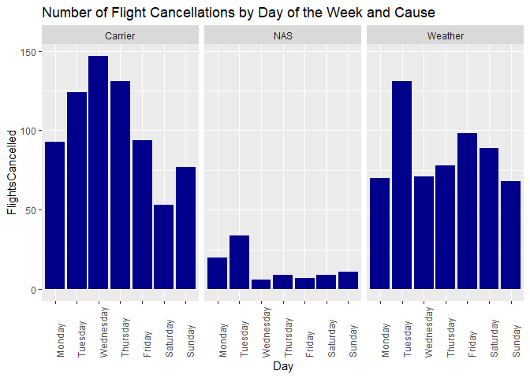
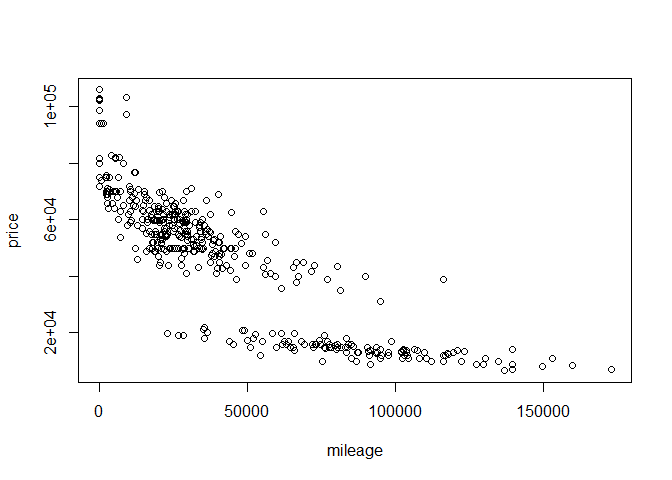
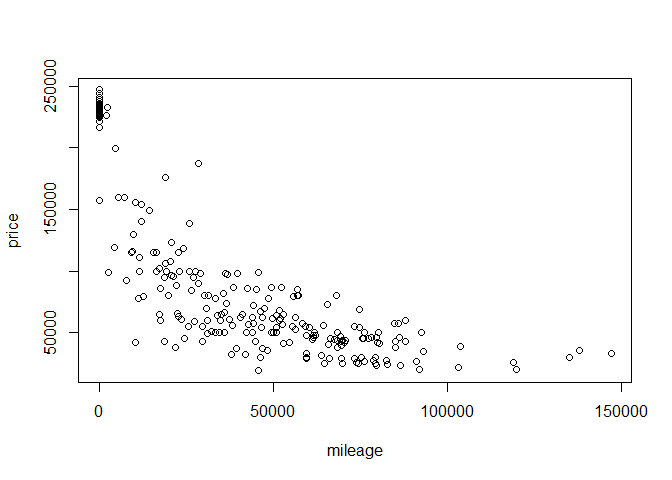

Question 1
----------

With our Austin flight data, I wanted to look at cancellations not just
by the day of the week, but also by the listed cause of delay.

There are some clear trends that can be seen in these bar graphs.
Carrier cancellations are most common during the week and less common on
weekend flights. NAS cancellations are more common on Monday and
Tuesday, with the rest of the days being fairly similar. Lastly, weather
delays are more common on weekends, but Tuesday seems to be an outlier.

Question 2
----------

The following is from the code Dr. Scott provided that extracts the 350
and 65 AMG trim levels as subsets of the data.

    ##        id             trim       subTrim    condition  isOneOwner
    ##  Min.   :  282   350    :416   Hybrid:  0   CPO :131   f:310     
    ##  1st Qu.:14290   320    :  0   unsp  :416   New : 15   t:106     
    ##  Median :26658   400    :  0                Used:270             
    ##  Mean   :26520   420    :  0                                     
    ##  3rd Qu.:39599   430    :  0                                     
    ##  Max.   :52220   450    :  0                                     
    ##                  (Other):  0                                     
    ##     mileage            year          color      displacement
    ##  Min.   :     6   Min.   :1994   Black  :219   3.0 L  :302  
    ##  1st Qu.: 19264   1st Qu.:2006   Silver : 77   3.7 L  :109  
    ##  Median : 29998   Median :2012   White  : 48   3.5 L  :  5  
    ##  Mean   : 42926   Mean   :2010   Gray   : 30   3.2 L  :  0  
    ##  3rd Qu.: 63479   3rd Qu.:2012   unsp   : 21   4.2 L  :  0  
    ##  Max.   :173000   Max.   :2013   Blue   : 11   4.3 L  :  0  
    ##                                  (Other): 10   (Other):  0  
    ##        fuel         state         region             soundSystem 
    ##  Diesel  :307   CA     : 57   SoA    :138   Alpine         :  0  
    ##  Gasoline:109   FL     : 47   Pac    : 68   Bang Olufsen   :  5  
    ##  Hybrid  :  0   TX     : 41   Mid    : 52   Bose           : 18  
    ##  unsp    :  0   IL     : 37   ENC    : 51   Boston Acoustic:  0  
    ##                 VA     : 32   WSC    : 45   Harman Kardon  :106  
    ##                 NJ     : 27   New    : 24   Premium        :130  
    ##                 (Other):175   (Other): 38   unsp           :157  
    ##    wheelType     wheelSize    featureCount        price       
    ##  Alloy  :225   unsp   :384   Min.   :  0.00   Min.   :  6600  
    ##  Chrome :  1   18     : 12   1st Qu.: 31.75   1st Qu.: 19401  
    ##  Premium:  6   17     : 10   Median : 54.00   Median : 52900  
    ##  Steel  :  0   19     :  6   Mean   : 49.22   Mean   : 46854  
    ##  unsp   :184   20     :  4   3rd Qu.: 70.00   3rd Qu.: 61991  
    ##                16     :  0   Max.   :112.00   Max.   :106010  
    ##                (Other):  0

    ##        id             trim       subTrim    condition  isOneOwner
    ##  Min.   : 1060   65 AMG :292   Hybrid:  0   CPO : 26   f:254     
    ##  1st Qu.:13977   320    :  0   unsp  :292   New : 91   t: 38     
    ##  Median :26557   350    :  0                Used:175             
    ##  Mean   :26444   400    :  0                                     
    ##  3rd Qu.:38687   420    :  0                                     
    ##  Max.   :52326   430    :  0                                     
    ##                  (Other):  0                                     
    ##     mileage            year          color      displacement
    ##  Min.   :     1   Min.   :2006   Black  :182   6.0 L  :285  
    ##  1st Qu.:    20   1st Qu.:2007   Silver : 39   unsp   :  7  
    ##  Median : 28803   Median :2010   White  : 27   3.0 L  :  0  
    ##  Mean   : 33700   Mean   :2010   Gray   : 22   3.2 L  :  0  
    ##  3rd Qu.: 58496   3rd Qu.:2015   unsp   : 10   3.5 L  :  0  
    ##  Max.   :146975   Max.   :2015   Blue   :  7   3.7 L  :  0  
    ##                                  (Other):  5   (Other):  0  
    ##        fuel         state         region            soundSystem 
    ##  Diesel  :  0   CA     : 75   Pac    :79   Alpine         :  0  
    ##  Gasoline:279   FL     : 44   SoA    :63   Bang Olufsen   : 31  
    ##  Hybrid  :  0   TX     : 27   Mid    :34   Bose           : 13  
    ##  unsp    : 13   IL     : 18   ENC    :33   Boston Acoustic:  0  
    ##                 NY     : 15   WSC    :32   Harman Kardon  : 42  
    ##                 NJ     : 12   Mtn    :17   Premium        : 92  
    ##                 (Other):101   (Other):34   unsp           :114  
    ##    wheelType     wheelSize    featureCount        price       
    ##  Alloy  :136   unsp   :252   Min.   :  0.00   Min.   : 18990  
    ##  Chrome :  2   20     : 39   1st Qu.: 17.00   1st Qu.: 48711  
    ##  Premium:  9   18     :  1   Median : 58.00   Median : 79995  
    ##  Steel  :  0   16     :  0   Mean   : 48.09   Mean   :117121  
    ##  unsp   :145   17     :  0   3rd Qu.: 72.00   3rd Qu.:225975  
    ##                19     :  0   Max.   :112.00   Max.   :247075  
    ##                (Other):  0

The following are the Root Mean-Squared Errors (RMSE) for each of the
trim types at specified: \#\#\#\#\#\# Trim: 350 - (K = 3) =
`rmse(y_test350, ypred_knn3_350)`
