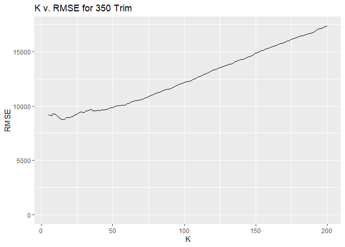
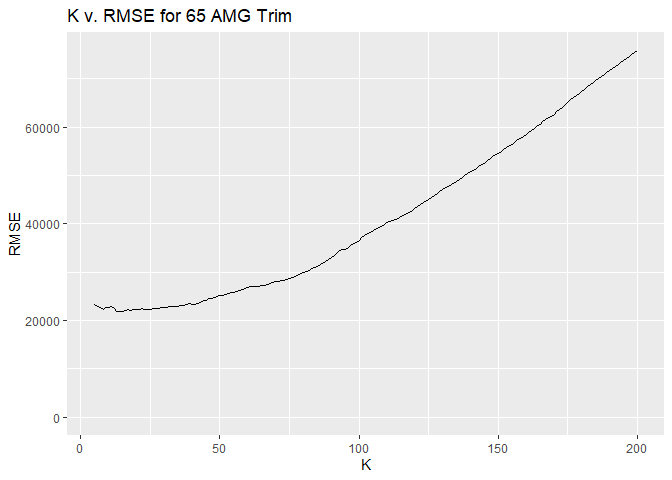
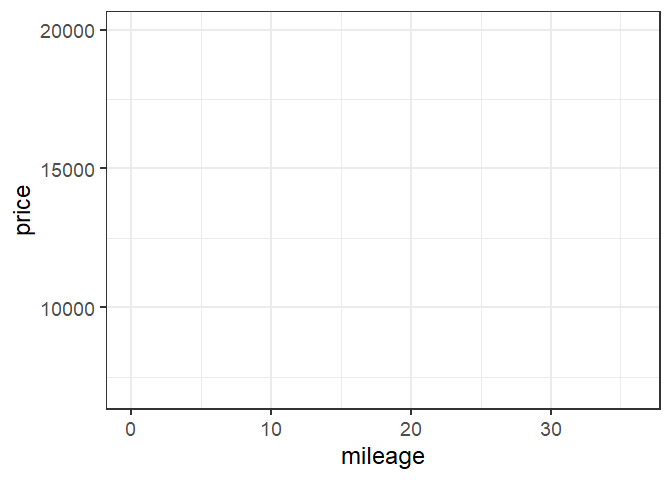

Question 1
----------

With our Austin flight data, I wanted to look at cancellations not just
by the day of the week, but also by the listed cause of delay.

There are some clear trends that can be seen in these bar graphs.
Carrier cancellations are most common during the week and less common on
weekend flights. NAS cancellations are more common on Monday and
Tuesday, with the rest of the days being fairly similar. Lastly, weather
delays are more common on weekends, but Tuesday seems to be an outlier.

Question 2
----------

The following is from the code Dr. Scott provided that extracts the 350
and 65 AMG trim levels as subsets of the data.

    ##        id             trim       subTrim    condition  isOneOwner
    ##  Min.   :  282   350    :416   Hybrid:  0   CPO :131   f:310     
    ##  1st Qu.:14290   320    :  0   unsp  :416   New : 15   t:106     
    ##  Median :26658   400    :  0                Used:270             
    ##  Mean   :26520   420    :  0                                     
    ##  3rd Qu.:39599   430    :  0                                     
    ##  Max.   :52220   450    :  0                                     
    ##                  (Other):  0                                     
    ##     mileage            year          color      displacement
    ##  Min.   :     6   Min.   :1994   Black  :219   3.0 L  :302  
    ##  1st Qu.: 19264   1st Qu.:2006   Silver : 77   3.7 L  :109  
    ##  Median : 29998   Median :2012   White  : 48   3.5 L  :  5  
    ##  Mean   : 42926   Mean   :2010   Gray   : 30   3.2 L  :  0  
    ##  3rd Qu.: 63479   3rd Qu.:2012   unsp   : 21   4.2 L  :  0  
    ##  Max.   :173000   Max.   :2013   Blue   : 11   4.3 L  :  0  
    ##                                  (Other): 10   (Other):  0  
    ##        fuel         state         region             soundSystem 
    ##  Diesel  :307   CA     : 57   SoA    :138   Alpine         :  0  
    ##  Gasoline:109   FL     : 47   Pac    : 68   Bang Olufsen   :  5  
    ##  Hybrid  :  0   TX     : 41   Mid    : 52   Bose           : 18  
    ##  unsp    :  0   IL     : 37   ENC    : 51   Boston Acoustic:  0  
    ##                 VA     : 32   WSC    : 45   Harman Kardon  :106  
    ##                 NJ     : 27   New    : 24   Premium        :130  
    ##                 (Other):175   (Other): 38   unsp           :157  
    ##    wheelType     wheelSize    featureCount        price       
    ##  Alloy  :225   unsp   :384   Min.   :  0.00   Min.   :  6600  
    ##  Chrome :  1   18     : 12   1st Qu.: 31.75   1st Qu.: 19401  
    ##  Premium:  6   17     : 10   Median : 54.00   Median : 52900  
    ##  Steel  :  0   19     :  6   Mean   : 49.22   Mean   : 46854  
    ##  unsp   :184   20     :  4   3rd Qu.: 70.00   3rd Qu.: 61991  
    ##                16     :  0   Max.   :112.00   Max.   :106010  
    ##                (Other):  0

    ##        id             trim       subTrim    condition  isOneOwner
    ##  Min.   : 1060   65 AMG :292   Hybrid:  0   CPO : 26   f:254     
    ##  1st Qu.:13977   320    :  0   unsp  :292   New : 91   t: 38     
    ##  Median :26557   350    :  0                Used:175             
    ##  Mean   :26444   400    :  0                                     
    ##  3rd Qu.:38687   420    :  0                                     
    ##  Max.   :52326   430    :  0                                     
    ##                  (Other):  0                                     
    ##     mileage            year          color      displacement
    ##  Min.   :     1   Min.   :2006   Black  :182   6.0 L  :285  
    ##  1st Qu.:    20   1st Qu.:2007   Silver : 39   unsp   :  7  
    ##  Median : 28803   Median :2010   White  : 27   3.0 L  :  0  
    ##  Mean   : 33700   Mean   :2010   Gray   : 22   3.2 L  :  0  
    ##  3rd Qu.: 58496   3rd Qu.:2015   unsp   : 10   3.5 L  :  0  
    ##  Max.   :146975   Max.   :2015   Blue   :  7   3.7 L  :  0  
    ##                                  (Other):  5   (Other):  0  
    ##        fuel         state         region            soundSystem 
    ##  Diesel  :  0   CA     : 75   Pac    :79   Alpine         :  0  
    ##  Gasoline:279   FL     : 44   SoA    :63   Bang Olufsen   : 31  
    ##  Hybrid  :  0   TX     : 27   Mid    :34   Bose           : 13  
    ##  unsp    : 13   IL     : 18   ENC    :33   Boston Acoustic:  0  
    ##                 NY     : 15   WSC    :32   Harman Kardon  : 42  
    ##                 NJ     : 12   Mtn    :17   Premium        : 92  
    ##                 (Other):101   (Other):34   unsp           :114  
    ##    wheelType     wheelSize    featureCount        price       
    ##  Alloy  :136   unsp   :252   Min.   :  0.00   Min.   : 18990  
    ##  Chrome :  2   20     : 39   1st Qu.: 17.00   1st Qu.: 48711  
    ##  Premium:  9   18     :  1   Median : 58.00   Median : 79995  
    ##  Steel  :  0   16     :  0   Mean   : 48.09   Mean   :117121  
    ##  unsp   :145   17     :  0   3rd Qu.: 72.00   3rd Qu.:225975  
    ##                19     :  0   Max.   :112.00   Max.   :247075  
    ##                (Other):  0

The following are the Root Mean-Squared Errors (RMSE) for each of the
trim types at specified:

### Trim: 350

-   (K = 5) = 9192.9228114
-   (K = 10) = 9226.7710819
-   (K = 25) = 9264.8301483
-   (K = 50) = 9849.9706919
-   (K = 100) = 1.213756610^{4}
-   (K = 150) = 1.486349310^{4}
-   (K = 200) = 1.734824310^{4}

### Trim: 65 AMG

-   (K = 5) = 2.321193110^{4}
-   (K = 10) = 2.260424710^{4}
-   (K = 25) = 2.231984910^{4}
-   (K = 50) = 2.507992310^{4}
-   (K = 100) = 3.661269710^{4}
-   (K = 150) = 5.46375610^{4}
-   (K = 200) = 7.577430110^{4}

We can look at plots of RMSE versus K to estimate what the optimal K is
for each trim.

    ## -------------------------------------------------------------------------

    ## You have loaded plyr after dplyr - this is likely to cause problems.
    ## If you need functions from both plyr and dplyr, please load plyr first, then dplyr:
    ## library(plyr); library(dplyr)

    ## -------------------------------------------------------------------------

    ## 
    ## Attaching package: 'plyr'

    ## The following object is masked from 'package:mosaic':
    ## 
    ##     count

    ## The following objects are masked from 'package:dplyr':
    ## 
    ##     arrange, count, desc, failwith, id, mutate, rename, summarise,
    ##     summarize

    ## The following object is masked from 'package:purrr':
    ## 
    ##     compact

    ##          RMSE   K
    ## 1       0.000   0
    ## 2       0.000   0
    ## 3       0.000   0
    ## 4       0.000   0
    ## 5    9192.923   5
    ## 6    9182.183   6
    ## 7    9069.779   7
    ## 8    9297.219   8
    ## 9    9271.712   9
    ## 10   9226.771  10
    ## 11   9080.440  11
    ## 12   8960.210  12
    ## 13   8823.021  13
    ## 14   8777.917  14
    ## 15   8763.954  15
    ## 16   8756.604  16
    ## 17   8880.792  17
    ## 18   8918.310  18
    ## 19   8947.411  19
    ## 20   8940.468  20
    ## 21   9030.383  21
    ## 22   9049.838  22
    ## 23   9187.377  23
    ## 24   9190.400  24
    ## 25   9264.830  25
    ## 26   9362.384  26
    ## 27   9395.373  27
    ## 28   9459.578  28
    ## 29   9417.877  29
    ## 30   9404.048  30
    ## 31   9532.640  31
    ## 32   9545.633  32
    ## 33   9594.306  33
    ## 34   9644.875  34
    ## 35   9671.211  35
    ## 36   9549.107  36
    ## 37   9565.513  37
    ## 38   9555.971  38
    ## 39   9576.237  39
    ## 40   9593.143  40
    ## 41   9574.867  41
    ## 42   9633.066  42
    ## 43   9650.929  43
    ## 44   9669.205  44
    ## 45   9706.307  45
    ## 46   9699.035  46
    ## 47   9729.617  47
    ## 48   9839.812  48
    ## 49   9852.636  49
    ## 50   9849.971  50
    ## 51   9916.031  51
    ## 52  10001.094  52
    ## 53  10005.702  53
    ## 54  10025.846  54
    ## 55  10041.835  55
    ## 56  10079.381  56
    ## 57  10083.344  57
    ## 58  10093.310  58
    ## 59  10118.159  59
    ## 60  10219.294  60
    ## 61  10236.132  61
    ## 62  10290.459  62
    ## 63  10390.716  63
    ## 64  10421.892  64
    ## 65  10474.399  65
    ## 66  10480.648  66
    ## 67  10501.917  67
    ## 68  10524.217  68
    ## 69  10536.735  69
    ## 70  10590.917  70
    ## 71  10657.026  71
    ## 72  10692.776  72
    ## 73  10784.969  73
    ## 74  10805.308  74
    ## 75  10893.923  75
    ## 76  10949.015  76
    ## 77  11001.005  77
    ## 78  11040.778  78
    ## 79  11101.983  79
    ## 80  11161.958  80
    ## 81  11201.322  81
    ## 82  11256.742  82
    ## 83  11280.186  83
    ## 84  11335.294  84
    ## 85  11383.693  85
    ## 86  11487.224  86
    ## 87  11506.729  87
    ## 88  11542.695  88
    ## 89  11563.361  89
    ## 90  11587.789  90
    ## 91  11641.474  91
    ## 92  11683.706  92
    ## 93  11764.344  93
    ## 94  11838.943  94
    ## 95  11913.073  95
    ## 96  11971.729  96
    ## 97  12007.323  97
    ## 98  12045.624  98
    ## 99  12095.526  99
    ## 100 12137.566 100
    ## 101 12210.227 101
    ## 102 12236.905 102
    ## 103 12268.867 103
    ## 104 12323.125 104
    ## 105 12347.033 105
    ## 106 12419.451 106
    ## 107 12472.101 107
    ## 108 12536.323 108
    ## 109 12612.476 109
    ## 110 12667.182 110
    ## 111 12736.653 111
    ## 112 12782.978 112
    ## 113 12850.793 113
    ## 114 12926.593 114
    ## 115 12972.855 115
    ## 116 12996.255 116
    ## 117 13108.147 117
    ## 118 13152.019 118
    ## 119 13224.375 119
    ## 120 13271.604 120
    ## 121 13335.274 121
    ## 122 13360.158 122
    ## 123 13423.030 123
    ## 124 13495.840 124
    ## 125 13547.500 125
    ## 126 13588.264 126
    ## 127 13624.286 127
    ## 128 13661.645 128
    ## 129 13703.905 129
    ## 130 13745.687 130
    ## 131 13792.526 131
    ## 132 13863.846 132
    ## 133 13884.707 133
    ## 134 13932.483 134
    ## 135 14053.715 135
    ## 136 14089.818 136
    ## 137 14167.710 137
    ## 138 14217.891 138
    ## 139 14256.634 139
    ## 140 14279.139 140
    ## 141 14308.821 141
    ## 142 14338.352 142
    ## 143 14390.547 143
    ## 144 14473.657 144
    ## 145 14545.516 145
    ## 146 14596.069 146
    ## 147 14641.983 147
    ## 148 14660.908 148
    ## 149 14788.483 149
    ## 150 14863.493 150
    ## 151 14905.922 151
    ## 152 14972.401 152
    ## 153 15023.500 153
    ## 154 15080.882 154
    ## 155 15116.601 155
    ## 156 15174.217 156
    ## 157 15236.284 157
    ## 158 15298.210 158
    ## 159 15334.251 159
    ## 160 15399.455 160
    ## 161 15426.116 161
    ## 162 15461.012 162
    ## 163 15522.259 163
    ## 164 15578.331 164
    ## 165 15633.878 165
    ## 166 15671.883 166
    ## 167 15737.163 167
    ## 168 15770.673 168
    ## 169 15813.327 169
    ## 170 15867.390 170
    ## 171 15918.688 171
    ## 172 15981.510 172
    ## 173 16017.010 173
    ## 174 16084.798 174
    ## 175 16132.362 175
    ## 176 16164.606 176
    ## 177 16214.951 177
    ## 178 16265.902 178
    ## 179 16325.906 179
    ## 180 16372.568 180
    ## 181 16414.133 181
    ## 182 16463.764 182
    ## 183 16490.403 183
    ## 184 16507.168 184
    ## 185 16569.309 185
    ## 186 16622.056 186
    ## 187 16657.728 187
    ## 188 16688.009 188
    ## 189 16720.635 189
    ## 190 16773.534 190
    ## 191 16865.163 191
    ## 192 16950.161 192
    ## 193 17038.776 193
    ## 194 17089.880 194
    ## 195 17112.109 195
    ## 196 17153.363 196
    ## 197 17242.163 197
    ## 198 17252.126 198
    ## 199 17306.298 199
    ## 200 17348.243 200

    ## Warning: Removed 4 rows containing missing values (geom_path).

 For the 350
trim, our optimum value of K is K = 15

    ##         RMSE   K
    ## 1       0.00   0
    ## 2       0.00   0
    ## 3       0.00   0
    ## 4       0.00   0
    ## 5   23211.93   5
    ## 6   22842.97   6
    ## 7   22759.87   7
    ## 8   22290.65   8
    ## 9   22638.05   9
    ## 10  22604.25  10
    ## 11  22861.41  11
    ## 12  22556.80  12
    ## 13  21939.44  13
    ## 14  21758.25  14
    ## 15  21846.47  15
    ## 16  22096.58  16
    ## 17  22276.83  17
    ## 18  22098.45  18
    ## 19  22346.61  19
    ## 20  22270.93  20
    ## 21  22284.89  21
    ## 22  22398.16  22
    ## 23  22367.84  23
    ## 24  22197.63  24
    ## 25  22319.85  25
    ## 26  22485.52  26
    ## 27  22446.06  27
    ## 28  22519.20  28
    ## 29  22670.14  29
    ## 30  22674.30  30
    ## 31  22726.32  31
    ## 32  22958.08  32
    ## 33  22944.27  33
    ## 34  22920.79  34
    ## 35  22913.21  35
    ## 36  23093.47  36
    ## 37  23118.18  37
    ## 38  23358.21  38
    ## 39  23447.52  39
    ## 40  23324.35  40
    ## 41  23350.71  41
    ## 42  23537.83  42
    ## 43  23781.43  43
    ## 44  24061.14  44
    ## 45  24210.80  45
    ## 46  24447.25  46
    ## 47  24640.17  47
    ## 48  24788.36  48
    ## 49  24931.33  49
    ## 50  25079.92  50
    ## 51  25231.81  51
    ## 52  25430.01  52
    ## 53  25569.76  53
    ## 54  25758.42  54
    ## 55  25863.87  55
    ## 56  26089.54  56
    ## 57  26268.13  57
    ## 58  26368.56  58
    ## 59  26559.41  59
    ## 60  26728.17  60
    ## 61  26937.60  61
    ## 62  26968.82  62
    ## 63  27008.58  63
    ## 64  27094.30  64
    ## 65  27226.58  65
    ## 66  27269.94  66
    ## 67  27500.89  67
    ## 68  27673.46  68
    ## 69  27830.94  69
    ## 70  27967.77  70
    ## 71  28118.34  71
    ## 72  28190.87  72
    ## 73  28236.60  73
    ## 74  28411.15  74
    ## 75  28629.59  75
    ## 76  28875.85  76
    ## 77  29064.49  77
    ## 78  29263.47  78
    ## 79  29680.76  79
    ## 80  29930.40  80
    ## 81  30177.62  81
    ## 82  30421.52  82
    ## 83  30661.05  83
    ## 84  30901.03  84
    ## 85  31195.62  85
    ## 86  31549.68  86
    ## 87  31850.17  87
    ## 88  32104.09  88
    ## 89  32583.76  89
    ## 90  32995.40  90
    ## 91  33535.10  91
    ## 92  33954.64  92
    ## 93  34528.80  93
    ## 94  34752.88  94
    ## 95  34783.18  95
    ## 96  35128.85  96
    ## 97  35555.63  97
    ## 98  35829.77  98
    ## 99  36209.71  99
    ## 100 36612.70 100
    ## 101 37170.62 101
    ## 102 37524.90 102
    ## 103 37910.29 103
    ## 104 38129.47 104
    ## 105 38569.56 105
    ## 106 38843.33 106
    ## 107 39201.48 107
    ## 108 39443.90 108
    ## 109 39889.11 109
    ## 110 40260.09 110
    ## 111 40379.78 111
    ## 112 40627.13 112
    ## 113 40908.00 113
    ## 114 41180.17 114
    ## 115 41562.79 115
    ## 116 41819.91 116
    ## 117 42107.58 117
    ## 118 42378.16 118
    ## 119 42810.66 119
    ## 120 43199.76 120
    ## 121 43560.67 121
    ## 122 43945.59 122
    ## 123 44352.39 123
    ## 124 44695.80 124
    ## 125 45112.46 125
    ## 126 45523.72 126
    ## 127 45874.79 127
    ## 128 46323.58 128
    ## 129 46709.51 129
    ## 130 47088.63 130
    ## 131 47531.46 131
    ## 132 47798.48 132
    ## 133 48142.83 133
    ## 134 48426.11 134
    ## 135 48842.19 135
    ## 136 49168.59 136
    ## 137 49638.30 137
    ## 138 49897.47 138
    ## 139 50316.44 139
    ## 140 50729.17 140
    ## 141 51029.43 141
    ## 142 51414.11 142
    ## 143 51796.82 143
    ## 144 52227.31 144
    ## 145 52481.25 145
    ## 146 53005.38 146
    ## 147 53514.80 147
    ## 148 53886.22 148
    ## 149 54284.56 149
    ## 150 54637.56 150
    ## 151 54988.59 151
    ## 152 55299.27 152
    ## 153 55731.29 153
    ## 154 56147.52 154
    ## 155 56512.48 155
    ## 156 56941.20 156
    ## 157 57351.37 157
    ## 158 57726.43 158
    ## 159 58088.14 159
    ## 160 58497.57 160
    ## 161 58925.36 161
    ## 162 59318.38 162
    ## 163 59794.11 163
    ## 164 60244.56 164
    ## 165 60632.64 165
    ## 166 61100.13 166
    ## 167 61534.98 167
    ## 168 61906.40 168
    ## 169 62291.49 169
    ## 170 62689.88 170
    ## 171 63151.76 171
    ## 172 63617.48 172
    ## 173 64158.55 173
    ## 174 64685.53 174
    ## 175 65147.68 175
    ## 176 65661.74 176
    ## 177 66097.65 177
    ## 178 66544.71 178
    ## 179 66981.33 179
    ## 180 67411.24 180
    ## 181 67845.48 181
    ## 182 68319.27 182
    ## 183 68807.55 183
    ## 184 69169.00 184
    ## 185 69614.08 185
    ## 186 70082.74 186
    ## 187 70514.33 187
    ## 188 70943.52 188
    ## 189 71352.02 189
    ## 190 71775.88 190
    ## 191 72167.27 191
    ## 192 72564.17 192
    ## 193 73003.88 193
    ## 194 73405.14 194
    ## 195 73833.27 195
    ## 196 74216.51 196
    ## 197 74621.01 197
    ## 198 74962.71 198
    ## 199 75369.51 199
    ## 200 75774.30 200

    ## Warning: Removed 4 rows containing missing values (geom_path).

 It is harder
to tell for the 65 AMG trim, but it seems that our optimal K is
approximately 25.

    knn_model65 = knn.reg(X_train65, X_train65, y_train65, k = 15)

    D_train65$ypred = knn_model65$pred
    p_train65 = ggplot(data = D_train65) + 
      geom_point(mapping = aes(x = mileage, y = price), color='lightgrey') + 
      theme_bw(base_size=18) + 
      ylim(7000, 20000) + xlim(0,36)
    p_train65 + geom_path(mapping = aes(x=mileage, y=ypred), color='red', size=1.5)

    ## Warning: Removed 233 rows containing missing values (geom_point).

    ## Warning: Removed 233 rows containing missing values (geom_path).

