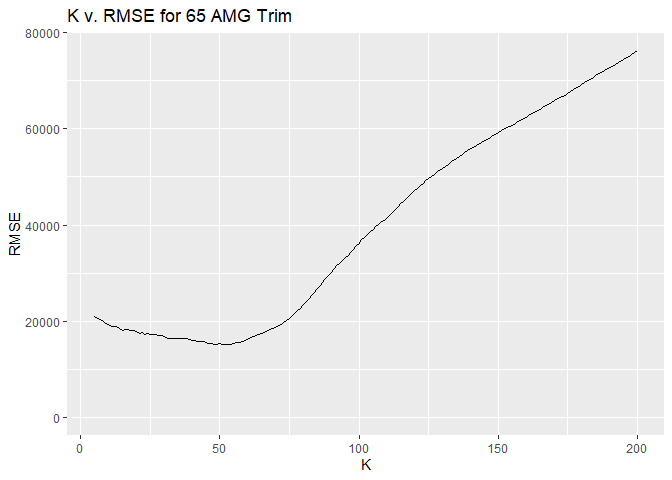

Question 1
----------

### Data

We started with data on commercial flights arriving or departing from
Austin in the year 2008. With our data, I wanted to look at
cancellations not just by the day of the week, but also by the listed
cause of delay.

### Conclusions

There are some clear trends that can be seen in these bar graphs.
Carrier cancellations are most common during the week and less common on
weekend flights. NAS cancellations are more common on Monday and
Tuesday, with the rest of the days being fairly similar. Lastly, weather
delays are more common on weekends, but Tuesday seems to be an outlier.

Question 2
----------

### Data

The following are plots that show the price and mileage for Mercedes
S-Class vehicles by trim.

### Process

The goal is to predict the price of a S-Class vehicle by it’s mileage.
This will be done separately for the 350 and 65 AMG trims using the
K-Nearest Neighbors method of prediction, which averages a specifiedThe
following are the Root Mean-Squared Errors (RMSE) for each of the trim
types at specified:

### Trim: 350

-   (K = 5) = 10550.83
-   (K = 10) = 9749.663
-   (K = 25) = 10042.9
-   (K = 50) = 10534.91
-   (K = 100) = 10534.91
-   (K = 150) = 14366.23
-   (K = 200) = 16562.14

### Trim: 65 AMG

-   (K = 5) = 26064.08
-   (K = 10) = 24250.16
-   (K = 25) = 23160.28
-   (K = 50) = 24296.19
-   (K = 100) = 35937.45
-   (K = 150) = 53763.28
-   (K = 200) = 73465.3

We can look at plots of RMSE versus K to estimate what the optimal K is
for each trim.

### Results

For the 350 trim, our optimum value of K is K = 50

 It is harder
to tell for the 65 AMG trim, but it seems that our optimal K is
approximately 25.

\#\#\# Conclusion Of the two trims, the 350 trim has a higher optimal K
than the 65 AMG trim. This has nothing to do with the difference in the
trims. The main reason for the difference is that the subset of S-Class
cars with 350 trim is larger than the subset with 65 AMG trim. When you
have more data, the optimal value for K increases because your points
will be closer together and therefore create better predictions.
